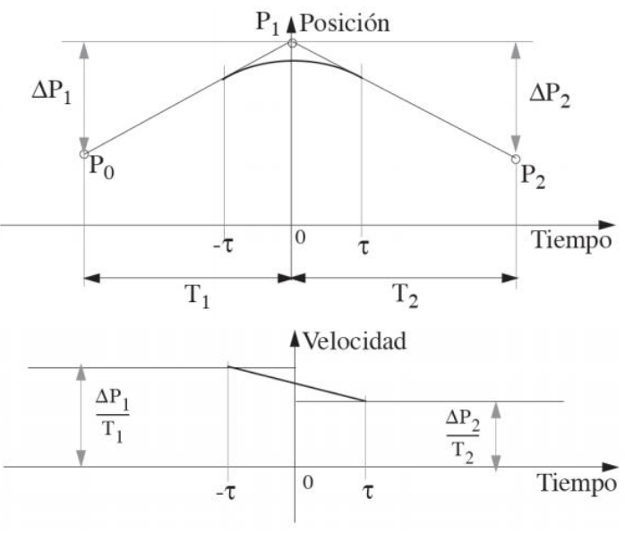
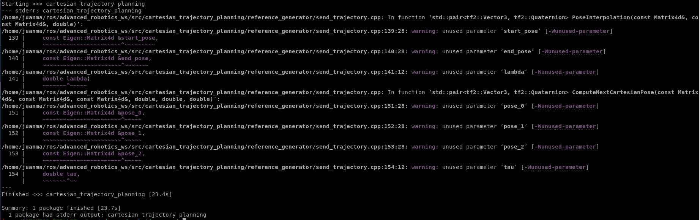
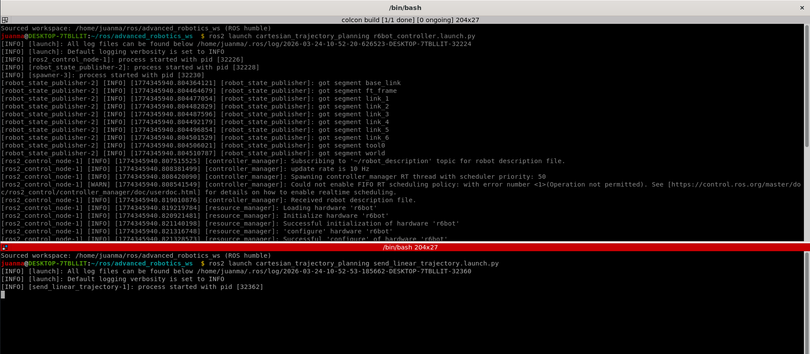
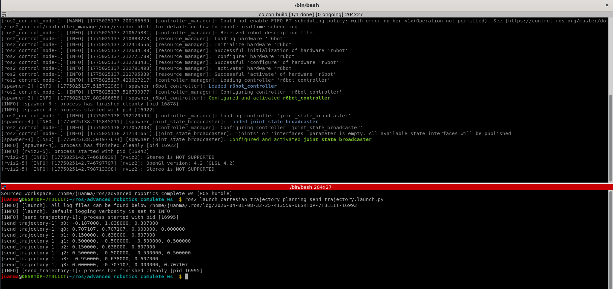
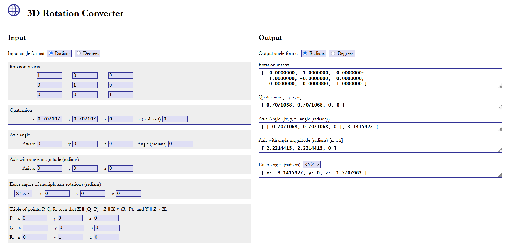
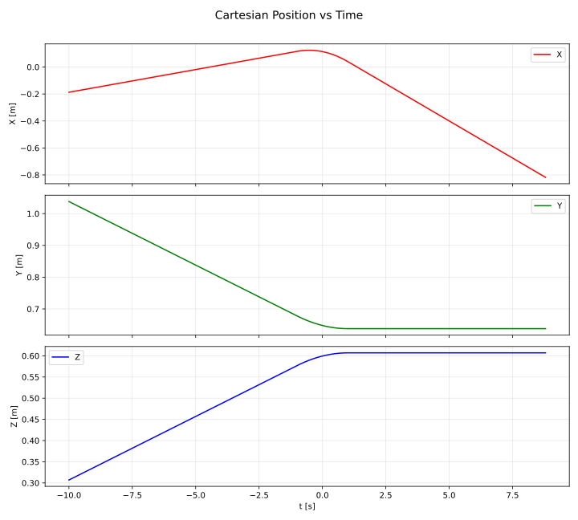
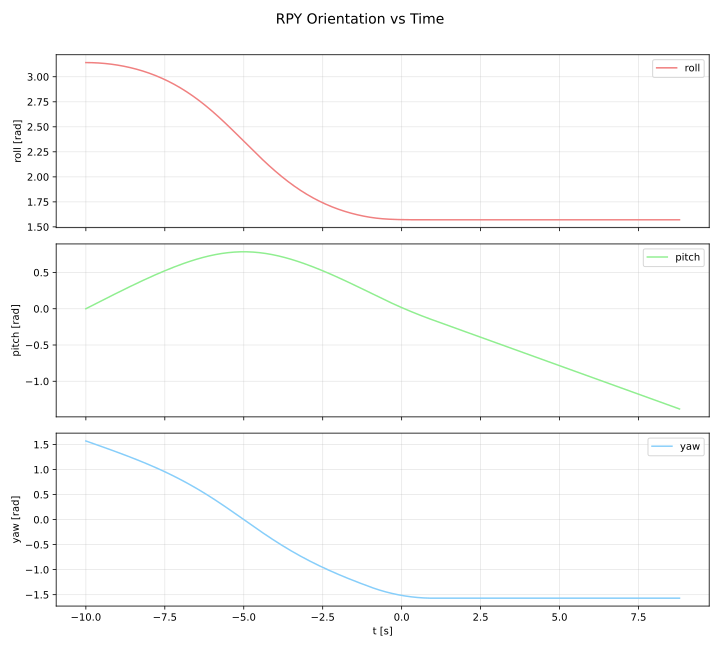

# Lab 1: Cartesian trajectory planning


# 1. Smooth Cartesian interpolation

Cartesian interpolation is characterized by achieving a linear variation of position and orientation. While when interpolating the position we can conduct a linear interpolation in the Cartesian space, for the orientation, the interpolation depends on how the orientation is represented. As described in the course, the most appropriate way to do this is by using quaternions. 

!!! info
    If you interpolate the orientation using quaternions, you're performing a [Spherical Linear Interpolation (slerp)](https://en.wikipedia.org/wiki/Spherical_linear_interpolation). Original paper [here](https://www.cs.cmu.edu/~kiranb/animation/p245-shoemake.pdf). The slerp method is actually implemented in [tf2](https://docs.ros.org/en/humble/p/tf2/generated/classtf2_1_1Quaternion.html) (you can check the code of the implementation ros2 humble [here](https://github.com/ros2/geometry2/blob/humble/tf2/include/tf2/LinearMath/Quaternion.hpp)) but you're going to implement it by yourself in this lab. 

Also, when linking two rectilinear displacements, a velocity discontinuity occurs at the transition point. Figure 1 shows the described situation, using the example of concatenating a displacement from location $P_0$ to $P_1$ (first segment) with another from $P_1$ to $P_2$ (second segment). To avoid the velocity discontinuity that would occur at $P_1$, a constant acceleration is used to linearly adapt the velocity variation from the first segment to the second, resulting in a smooth transition across $P_1$.



*Figure 1. Diagram of the variation of position and velocity in the movement from $P_0$ to $P_2$ via $P_1$.*

This way, $-\tau$ units of time before reaching $P_1$ (time 0), the velocity will be linearly changed over time from $\Delta P_1/T_1$ to $\Delta P_2/T_2$, to accommodate the velocity $\tau$ units of time after passing $P_1$. Thus, the problem is defined as the calculation of a quadratic function $\mathbf{p}(t)$ that starts at point $P_A$ and ends at $P_B$ (start and end points of the smoothing) defined in the time range $[-\tau, \tau]$.

Applying the boundary conditions at both ends of the segment and defining the acceleration in the area, the position is obtained as:

<a id="equation-1"></a>
$$
\mathbf{p}(t) = \mathbf{p}_1 - \frac{(\tau - t)^2}{4\tau T_1} \Delta \mathbf{p}_1 + \frac{(\tau + t)^2}{4\tau T_2} \Delta \mathbf{p}_2
$$

And the orientation as:

<a id="equation-2"></a>
$$
\mathbf{q}(t) = \mathbf{q}_1 \cdot  \mathbf{q} \left[\frac{-(\tau - t)^2}{4\tau T_1} \theta_1, \mathbf{n}_1 \right] \cdot \mathbf{q} \left[ \frac{(\tau + t)^2}{4\tau T_2} \theta_2, \mathbf{n}_2 \right]
$$

---

## 2. Setup ROS 2

For this lab session we will use ROS 2 Humble.

This is optional: You may want to install the [uma_environment_tools](https://github.com/jmgandarias/uma_environment_tools) as it will install ROS2 Humble, and some important packages and libraries that may be useful later in the course.
In that repo, you'll find the required steps to install it.

If you already have a native version of Ubuntu 22.04 installed, you can skip steps 1 and 2.

A video of the installation, including the troubleshooting (if you don't find the errors, you don't need to run that part!) is shown below. Note that the video shows the installation with WSL. If you're using a native Ubuntu 22.04, you can skip the first instruction.


### 2.1. Testing the UMA environment

If you have installed the UMA environment, you should see that everything is working correctly.

Try the following;

```bash
create_catkin_ws
```

Put the name `advanced_robotics_ws` to your workspace.

If, after installing it, you go to your catkin workspace folder and when you run this alias

```bash
cb
```

you find an error like `'ROS colcon build is not installed'`, then you'll need to uninstall ros and install the environment again:

```bash
sudo apt remove ~nros-humble-* && sudo apt autoremove
sudo rm /etc/apt/sources.list.d/ros2.list
sudo apt update
sudo apt autoremove
# Consider upgrading for packages previously shadowed.
sudo apt upgrade
cd ~/uma_environment_tools/scripts
./install_uma_environment.sh
```

Then you'll ned to run

```bash
update_uma_environment
```

---

## 3. Introduction

This exercise illustrates the generation of Cartesian trajectories using one of the methodologies studied in this course. For this purpose, you'll use the the [Cartesian Trajectory Planning](https://github.com/jmgandarias/cartesian_trajectory_planning) package.


## 3.1. Install the dependencies

First, you'll need to install a series of dependencies:

```bash
sudo apt install ros-${ROS_DISTRO}-xacro
sudo apt install ros-${ROS_DISTRO}-gazebo-ros-pkgs
sudo  apt install ros-${ROS_DISTRO}-ros2-control ros-${ROS_DISTRO}-ros2-controllers ros-${ROS_DISTRO}-gazebo-ros2-control
sudo apt-get install -y ros-${ROS_DISTRO}-joint-state-publisher-gui ros-${ROS_DISTRO}-rviz2
```

If you find an error trying to install these dependencies, most probably you'll need to update the packages repositories and upgrade them to the last version. Once upgraded, you can install the dependecies using the commands above.

```bash
sudo apt update
sudo apt upgrade
```

## 3.2. Clone the package

Open a new terminal, go to the `src` folder in yout worskpace and clone the repo

```bash
git clone https://github.com/jmgandarias/cartesian_trajectory_planning
```

Once this is done, complie the workspace (if you have installed the UMA environment you can just use `cb`).

You should see something like this (don't worry about the warnings, this is because the code is incompleted - you'll need to complete it in this lab session)



## 3.3. Package content

It consists of the following:

* bringup: launch files and ros2_controller configuration *:lock: You don't have to modify it.*
* config: poses.yaml file with the definition of the EE poses for the lab session *:pencil: You need to modify it in this lab.*
* controller: definition of the robot controller using ros2 control *:lock: You don't have to modify it.*
* description: the 6-DOF robot description (URDF and visualizer launch file) *:lock: You don't have to modify it.*
* experiment_data: you can use this folder to save and plot the data of the experiment *:pencil: You need to modify it in this lab.*
* hardware: ros2_control hardware interface *:lock: You don't have to modify it.*
* reference_generator: It has 3 cpp files
    * send_circular_trajectory.cpp: Example using a velocity controller with a circular trajectory. *:lock: You don't have to modify it.*
    * send_linear_trajectory.cpp:Example using a velocity controller with a linear trajectory. *:lock: You don't have to modify it.*
    * send_trajectory.cpp: This is the main file where you have to implement the Cartesian trajectory. *:pencil: You need to modify it in this lab.*

The content of this package is inspired by and built on the [ROS2 control example 7](https://control.ros.org/humble/doc/ros2_control_demos/example_7/doc/userdoc.html).

## 3.4. Test the demo

In one terminal, run:

```bash
ros2 launch cartesian_trajectory_planning r6bot_controller.launch.py
```

In another terminal, run:

```bash
ros2 launch cartesian_trajectory_planning send_linear_trajectory.launch.py 
```

To show the EE trail in Rviz:
* Go to RobotModel>Links>tool0 (or the link that refers to the EE).
* Habilitate Show Trail.

You should see the following:




You can also try the circular trajectory if you want:

```bash
ros2 launch cartesian_trajectory_planning send_circular_trajectory.launch.py 
```

These trajectories are generated because the robot is under a joint velocity controller with an Inverse Kinematics solver (implemented using the [ros2 control package](https://control.ros.org/humble/index.html) - Described in [Example 7](https://control.ros.org/humble/doc/ros2_control_demos/example_7/doc/userdoc.html)).


Snippet of the velocity-based circular trajecotry:
```cpp
for (int i = 0; i < trajectory_len; i++)
  {
    // set endpoint twist
    double t = i;

    // circular trajectory in xy plane
    double vx = 2.0 * 0.3 * cos(2 * M_PI * t / trajectory_len);
    double vy = -0.3 * sin(2 * M_PI * t / trajectory_len);
    twist.vel.x(vx);
    twist.vel.y(vy);

    // convert cart to joint velocities
    ik_vel_solver_->CartToJnt(joint_positions, twist, joint_velocities);

    ...
  }
```

Snippet of the velocity-based linear trajecotry:
```cpp
for (int i = 0; i < trajectory_len; i++)
  {
    // set endpoint twist
    double t = i;
    // compute the desired linear x velocity once and set both x and y components
    double vx = 2.0 * 0.3 * cos(2 * M_PI * t / trajectory_len);
    twist.vel.x(vx);
    twist.vel.y(vx);

    // convert cart to joint velocities
    ik_vel_solver_->CartToJnt(joint_positions, twist, joint_velocities);

    ...
  }
```

However, in this lab you'll implement a Cartesian interpolation using the robot under a joint position controller (using the same Inverse Kinematics solver that is already implemented with the [Kinemcatics and Dynamics Library (KDL)](https://www.orocos.org/kdl.html) — if you're interested, there are other libraries that can also do this (and much more), like [Pinocchio](https://stack-of-tasks.github.io/pinocchio/)).

---

# 4. Understanding the code

## 4.1. send_trajectory.cpp

This script performs the complete interpolation during all proposed segments. Let's see the code (each part of the code is explained in detail below):

<details>
    <summary>Show send_trajectory.cpp</summary>
    ```cpp title="send_trajectory.cpp"
    --8<-- "snippets/lab1/send_trajectory.cpp"
    ```
</details>

!!! warning 
    This repo is under development and keeps improving. To check the latest version, visit [the github repo](https://github.com/jmgandarias/cartesian_trajectory_planning/blob/main/reference_generator/send_trajectory.cpp).


## 4.2. Code parts explained

- ### `Eigen::Matrix4d ParsePoseMatrix(const YAML::Node &root, const std::string &key)`:lock:: 
    This function parses a 4x4 matrix from a YAML file given a specific key word. It's used in the code to parse the pose matrices defined in [`config/poses.yaml`](https://github.com/jmgandarias/cartesian_trajectory_planning/blob/main/config/poses.yaml). 

    <details>
        <summary>Show ParsePoseMatrix</summary>
        ```cpp title="ParsePoseMatrix.cpp"
        --8<-- "snippets/lab1/ParsePoseMatrix.cpp"
        ```
    </details>

    !!! info
        In the course you'll use the [`Eigen`](https://libeigen.gitlab.io/) library to work with linear algebra (matrices, vectors, etc) in C++. In this part of the code you are defining the object `pose` from the [`Matrix`](https://libeigen.gitlab.io/eigen/docs-nightly/group__TutorialMatrixClass.html) class.


    !!! info
        In the course you'll use [`YAML files`](https://yaml.org/).

- ### `tf2::Quaternion MuliplyQuaternions(const tf2::Quaternion &q1, const tf2::Quaternion &q2)` :lock:: 

    This function multiplies two quaternions q1 and q2 and returns the resulting quaternion. The multiplication is defined as: $q_{result} = q_1 * q_2$, where $q_1$ and $q_2$ are represented as $(x, y, z, w)$ and the product is performed using the [Hamilton product](https://en.wikipedia.org/wiki/Quaternion).

    <details>
        <summary>Show MuliplyQuaternions</summary>
        ```cpp title="MuliplyQuaternions.cpp"
        --8<-- "snippets/lab1/MuliplyQuaternions.cpp"
        ```
    </details>

    !!! info
        In the course you'll use the [`tf2`](https://docs.ros.org/en/humble/Tutorials/Intermediate/Tf2/Tf2-Main.html) package to work with coordinate frames and take advantage of useful classes and methods. In this part of the code you are using the class [`Quaternion`](https://docs.ros2.org/foxy/api/tf2/classtf2_1_1Quaternion.html).

- ### `tf2::Quaternion InverseQuaternion(const tf2::Quaternion &q)` :lock:: 
    
    This function computes the inverse of a quaternion $q$ and returns the resulting quaternion.

    <details>
        <summary>Show InverseQuaternion</summary>
        ```cpp title="InverseQuaternion.cpp"
        --8<-- "snippets/lab1/InverseQuaternion.cpp"
        ```
    </details>

- ### `tf2::Quaternion rot2Quat(const Eigen::Matrix3d &R, int m = 1)` :lock:: 

    This function converts a rotation matrix R to a quaternion representation.

    <details>
        <summary>Show rot2Quat</summary>
        ```cpp title="rot2Quat.cpp"
        --8<-- "snippets/lab1/rot2Quat.cpp"
        ```
    </details>

- ### `std::pair<tf2::Vector3, tf2::Quaternion> PoseInterpolation(const Eigen::Matrix4d &start_pose, const Eigen::Matrix4d &end_pose, double lambda)` :pencil:: 

    You must implement this function in the [Exercise 1](#51-exercise-1-cartesian-interpolation).
    
    This function interpolates between two poses (`start_pose` and `end_pose`) based on the interpolation parameter `lambda` $(\lambda \in [0, 1])$. It returns a pair containing the interpolated position (`tf2::Vector3`) and orientation (`tf2::Quaternion`).

    ```cpp title="PoseInterpolation.cpp"
    --8<-- "snippets/lab1/PoseInterpolation.cpp"
    ```

    !!! tip 
        When computing the relative quaternion $\mathbf{q}_{C}$ between two orientations $\mathbf{q}_A$ and $\mathbf{q}_B$, you should check that is less than $180 ^o$ to ensure that you're taking the shortest path:

        $$
        \mathbf{q}_{C} = \mathbf{q}_A^{-1} * \mathbf{q}_B
        $$

        ```cpp
        // Check that q_relative is less than 180 degrees to ensure the shortest path is taken
        if (q_relative.w() < 0)
        {
            q_relative = tf2::Quaternion(-q_relative.x(), -q_relative.y(), -q_relative.z(), -q_relative.w());
        }
        ```

- ### `std::pair<tf2::Vector3, tf2::Quaternion> ComputeNextCartesianPose(const Eigen::Matrix4d &pose_0, const Eigen::Matrix4d &pose_1, const Eigen::Matrix4d &pose_2, double tau, double T, double t)` :pencil:: 

    You must implement this function in the [Exercise 2](#52-exercise-2-smooth-trajectory-generation)

    ```cpp title="ComputeNextCartesianPose.cpp"
    --8<-- "snippets/lab1/ComputeNextCartesianPose.cpp"
    ```

- ### `int main(int argc, char **argv)` - First part :lock:: 

    The first part of the main include code needed to run the application that you don't need to change. The first part of the main initialices the node and publisher, gets the robot description, creates the kinematic chain and solvers using [KDL](https://www.orocos.org/kdl.html), creates the ROS 2 joint trajectory message that will be later filled in with the points you'll calculate, and gets the poses (`pose0, pose1, pose2`) from the `config/poses.yaml`.

    <details>
        <summary>Show int main(int argc, char **argv)</summary>
        ```cpp title="main.cpp"
        --8<-- "snippets/lab1/main.cpp"
        ```
    </details>

- ### Cartesian interpolation :pencil:: 

    This block runs the [Exercise 1](#51-exercise-1-cartesian-interpolation) code and checks your interpolation function. It calls `PoseInterpolation` at the endpoints of two segments:
    * pose0 -> pose1 with $\lambda = 0$ and $\lambda = 1$
    * pose1 -> pose2 with $\lambda = 0$ and $\lambda = 1$
    
    It stores each result as position (p*) and orientation quaternion (q*) and prints all four positions and quaternions to verify correctness. What you should expect if `PoseInterpolation` is implemented properly:

    * `p0, q0` should match pose0
    * `p1, q1` should match pose1
    * `p2, q2` should also match pose1 (start of second segment)
    * `p3, q3` should match pose2

    So this code does not generate the trajectory yet; it just validates that interpolation gives the correct boundary poses.

    ```cpp title="exercise1.cpp"
    --8<-- "snippets/lab1/exercise1.cpp"
    ```

- ### Smooth trajectory generation. Configuration :pencil:: 

    This block is the first part of the code needed for the [Exercise 2](#52-exercise-2-smooth-trajectory-generation). It is disabled by default. you have to set the variable `exercise_2 = true` once you've finished the [Exercise 1](#51-exercise-1-cartesian-interpolation). It defines: $\tau = 1$ and $T = 10$ as trajectory timing parameters. If enabled, it enables the trajectory generation.

    ```cpp title="exercise2_part1.cpp"
    --8<-- "snippets/lab1/exercise2_part1.cpp"
    ```

- ### Exercise 2: Smooth trajectory generation. Initialization :lock:: 

    This block is the second part of the code needed for the [Exercise 2](#52-exercise-2-smooth-trajectory-generation). If enabled, it initializes trajectory generation state:

    * Clears previous points from trajectory_msg.
    * Sets sampling period sample_time = 0.1 s.
    * Initializes `point_index` for time stamps.
    * It resolves where to save experiment data: a .csv file in the folder experiment_data.

    This part is mostly preparation: configure run parameters, choose output location, and prepare a CSV logger before the actual trajectory loop starts.
    Important detail: with `exercise_2 = false`, none of this executes.

    <details>
        <summary>Show Exercise 2, part 2</summary>
        ```cpp title="exercise2_part2.cpp"
        --8<-- "snippets/lab1/exercise2_part2.cpp"
        ```
    </details>

- ### Exercise 2: Smooth trajectory generation. Time loop :lock:: 

    This block is the third part of the code needed for the [Exercise 2](#52-exercise-2-smooth-trajectory-generation). This loop is the core trajectory sampler: for each time step, it computes one Cartesian pose, converts it to joint space, and appends one trajectory point.

    * The loop iterates from $t= −T$ to $t=T$ in steps of `sample_time`.
    * In every step, it calls `ComputeNextCartesianPose` (that you need to implement in [Exercise 2](#52-exercise-2-smooth-trajectory-generation)) to get the interpolated position `p_interp` and orientation quaternion `q_interp` at time t.
    * It also logs the data for analysis: Converts quaternion to roll/pitch/yaw, and writes t, X, Y, Z, roll, pitch, yaw of every trajectory point to the CSV file.
    * Packs `p_interp` and `q_interp` into a `KDL::Frame (desired_ee_pose)` for the end-effector. Then, it solves IK from current `joint_positions` to `desired_ee_pose`. If IK fails, prints an error and skips that time sample (continue).
    * It copies solved joint angles into `trajectory_point_msg.positions` and pushes the point into `trajectory_msg.points`.
    * Updates `joint_positions` with the solved values so next IK step starts near the previous one (improves continuity/convergence).

    So in short: Cartesian path sample -> IK -> trajectory point, repeated until the whole ROS joint trajectory is built.

    <details>
        <summary>Show Exercise 2, part 3</summary>
        ```cpp title="exercise2_part3.cpp"
        --8<-- "snippets/lab1/exercise2_part3.cpp"
        ```
    </details>

- ### End of the program :lock:: 

    This is the publish-and-wait tail of the node.

    * Safety check: If no trajectory points were generated, it prints an error and exits with code 1.
    * Wait for a subscriber: It loops until something subscribes to `/r6bot_controller/joint_trajectory`. While waiting, it logs a message and sleeps 200 ms to avoid busy-waiting. 
    * It sets the trajectory header stamp to “now + 0.2 s”. That small delay gives the controller a little lead time before execution starts.
    * It logs how many points will be sent, then publishes the full trajectory message.
    * It enters a loop while ROS is running. This keeps the process alive (instead of exiting immediately after publishing).

    So this section ensures the message is valid to send, waits for a listener, publishes once with a future start time, and then keeps the node running.

    <details>
        <summary>Show End of the code</summary>
        ```cpp title="end_of_code.cpp"
        --8<-- "snippets/lab1/end_of_code.cpp"
        ```
    </details>

---

## 5. Exercises

Considering all the above, and the following values for $\mathbf{P}_0, \mathbf{P}_1, \mathbf{P}_2$, the following exercises are requested:

$$
\mathbf{P}_0 = \begin{bmatrix}
0 &  1 & 0 & -0.187\\
1 & 0 &  0 &  1.038\\
0 & 0 & -1 &  0.307\\
0 &  0 &  0 & 1\\
\end{bmatrix},
\quad
\mathbf{P}_1 = \begin{bmatrix}
0 &  0 & -1 &  0.150\\
-1 &  0 & 0 & 0.638\\
0 & 1 & 0 &  0.607\\
0 &  0 & 0 &  1\\
\end{bmatrix},
\quad
\mathbf{P}_2 = \begin{bmatrix}
0 &  0 &  -1 & -0.950\\
0 &  1 & 0 &  0.638\\
1 &  0 & 0 &  0.607\\
0 &  0 &  0 &  1\\
\end{bmatrix}
$$

### 5.1. Exercise 1: Cartesian interpolation

Define the pose interpolation function based on the Taylor method in `std::pair<tf2::Vector3, tf2::Quaternion> PoseInterpolation(...)`. This function should perform a linear interpolation of the position and a slerp of the orientation between `start_pose` and `end_pose`. Hence, the function must return the intermediate position `p_interp` and intermediate quaternion `q_interp` based on `lambda` (knowing that $\lambda \in [0, 1]$). 

With the code in the [caresian interpolation block](#cartesian-interpolation) you can run the exercie 1 and verify whether your implementation of the Cartesian interpolation was correctly done.

#### 5.1.1. Expected results

When launching the script, you should see the following results:



You can check that the values `[p_inter, q_interp]` that the function `PoseInterpolation(pose0, pose1, lambda);` returns match the values of $\mathbf{P}_0$, $\mathbf{P}_1$, and $\mathbf{P}_2$ depending on which poses and lambda you're passing to the function.

Hence, if implemented correctly, you should have get the following:

```
[send_trajectory-1] p0: -0.187000, 1.038000, 0.307000
[send_trajectory-1] q0: 0.707107, 0.707107, 0.000000, 0.000000
[send_trajectory-1] p1: 0.150000, 0.638000, 0.607000
[send_trajectory-1] q1: 0.500000, -0.500000, -0.500000, 0.500000
[send_trajectory-1] p2: 0.150000, 0.638000, 0.607000
[send_trajectory-1] q2: 0.500000, -0.500000, -0.500000, 0.500000
[send_trajectory-1] p3: -0.950000, 0.638000, 0.607000
[send_trajectory-1] q3: 0.000000, -0.707107, 0.000000, 0.707107

```

!!! tip
    You can easily check the quaternion-rotation match using the [3D Rotation Converter](https://www.andre-gaschler.com/rotationconverter/)

    **Example with `q_0`:**

    


### 5.2. Exercise 2: Smooth trajectory generation

To carry out this exercise, first you need to set the boolean variable `exercise_2` in `int main()` to `true`:

```cpp
bool exercise_2 = true; // Set to true to execute Exercise 2
```

You must also define the [ComputeNextCartesianPose](#stdpairtf2vector3-tf2quaternion-computenextcartesianposeconst-eigenmatrix4d-pose_0-const-eigenmatrix4d-pose_1-const-eigenmatrix4d-pose_2-double-tau-double-t-double-t) function. This function is called inside the [trajectory loop](#exercise-2-smooth-trajectory-generation-time-loop) and returns the  corresponding pose (in the form of position – `tf2::Vector3 p_interp` and orientation – `tf2::Quaternion q_interp`) to the movement from $P_0$ (`pose0`) to $P_2$ (`pose2`) via $P_1$ (`pose1`) smoothed by the Taylor method at each timestep `t`. The parameters $\tau$ and $T$ correspond respectively to the transition interval and total time used to traverse the path as shown in Figure 1.

!!! question
    - What happens when you change the value of $\tau$? 
    - What happens when you change the value of $T$? 


#### 5.2.1. Graphical representation

Once the exercise is done, the data of the experiment is saved in the folder `YOUR_ROS_ws/src/cartesian_trajectory_planning/experiment_data`. 

The data is saved in a `.csv` file as a table with the following information: `t, X, Y, Z, roll, pitch, yaw`. This allow you to plot the position and orientation of the EE of the robot. The data is saved according to the following notation: `data_YearMonthDay_HourMinuteSecond` to be easy for you to find the experiment you want to plot.

You can use the python script `plot_data.py` that is in that folder to easily plot the data. If you run:

```bash
python3 plot_data.py
```

You'll plot the last experiment saved. Id you want to specify the experiemnt you want to plot, you can use:

```bash
python3 plot_data.py NAME_OF_THE_FILE.csv
```

Alternatively, you can load the `.csv` with any other software that allows you to manipulate and plot data, such as MATLAB.


#### 5.2.2. Expected results

The expected result of the complete is illustrated in the following video and figures:


*Video 1. Expected result of the lab session.*



*Figure 2. Position trajectories.*



*Figure 3. Orientation trajectories.*

# 6. Extra (optional)

In the lab session we