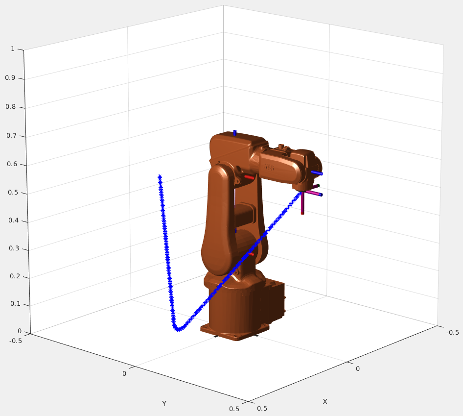
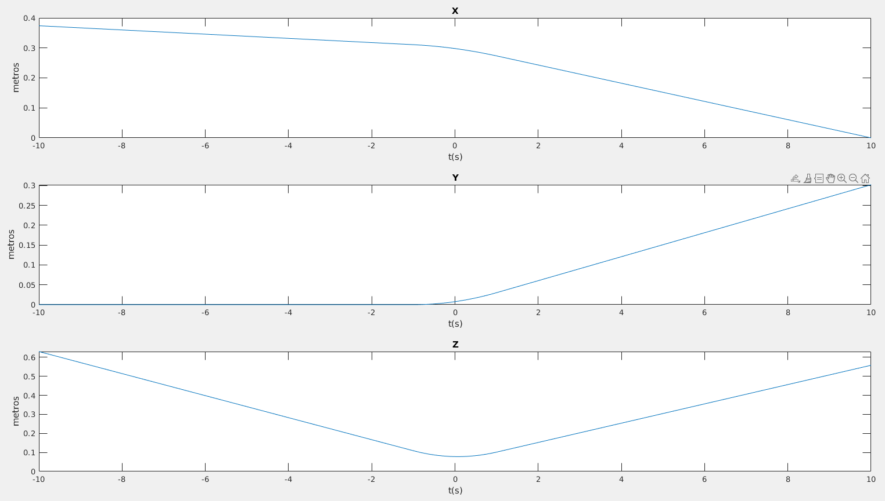
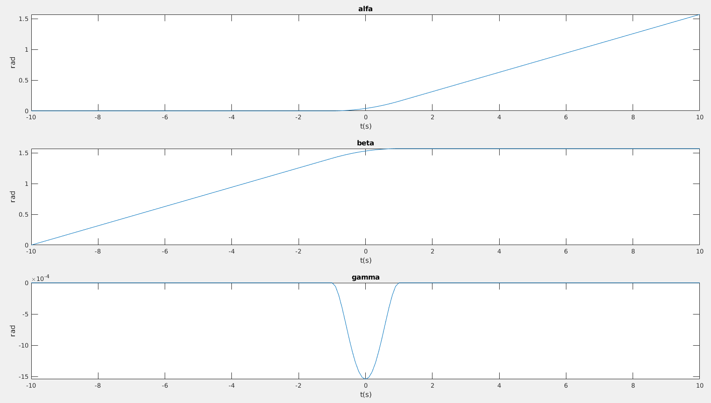

# Lab 1: Cartesian trajectory planning

This exercise illustrates the generation of Cartesian trajectories using one of the methodologies studied in this course. For this purpose, a series of functions will be used:

## Matlab functions

- **`cartesian_planning`**: Script that performs the complete simulation during all proposed segments, using the Robotic Toolbox with the ABB IRB120 manipulator model and the graphical representation of the temporal evolution of Cartesian trajectories and orientation in $ZYZ$ Euler angles.

    ```matlab title="cartesian_planning.m"
    --8<-- "snippets/lab1/cartesian_planning.m"
    ```

    1. Here you call the function ```qpinter``` that you have to code in [Exercise 1](#1-quaternion-interpolation)
    2. Here you call the function ```generate_smooth_path``` that you have to code in [Exercise 2](#1-quaternion-interpolation)

- **`function [pr, qr]=qpinter(P1, P2, lambda)`**: You have to code it. Explained in [Exercise 2](#2-smooth-trajectory-generation)

    ```matlab title="qpinter.m"
    --8<-- "snippets/lab1/qpinter.m"
    ```

    1. Compute the position interpolation.
    2. Compute the orientation interpolation

- **`function P=generate_smooth_path(P0, P1, P2, tau, T, t)`**: You have to code it. Explained in [Exercise 2](#2-smooth-trajectory-generation)

    ```matlab title="generate_smooth_path.m"
    --8<-- "snippets/lab1/generate_smooth_path.m"
    ```

    1. Include the code for the first segment (from -t to T) using qpinter
    2. Include the code for the third segment (from T to t) using qpinter
    3. Include the code for the position smoothing in the second segment with [Equation P(t)](#equation-1)
    4. Include the code for the orientation smoothing in the second segment with [Equation q(t)](#equation-2)

- **`function T=zyz2tr(a)`**: Converts the row vector $a=[\alpha,\beta,\gamma]$ of $ZYZ$ Euler angles to a $4 \times 4$ homogeneous transformation $T$.
    <details>
        <summary>Show function zyz2tr.m</summary>
        ```matlab title="zyz2tr.m"
        --8<-- "snippets/lab1/zyz2tr.m"
        ```
    </details>

- **`function a=tr2zyz(T, m)`**: Obtains the representation $a=[\alpha,\beta,\gamma]$ of the $ZYZ$ Euler angles from the transformation $T$. The sign of the parameter $m$ chooses the solution. If not specified, the positive solution is taken by default.
    <details>
        <summary>Show function tr2zyz.m</summary>
        ```matlab title="tr2zyz.m"
        --8<-- "snippets/lab1/tr2zyz.m"
        ```
    </details>

- **`function q=tr2q(T, m)`**: Converts the homogeneous matrix $T$ to quaternion $q$. The sign of $m$ chooses the positive or negative solution. If $m$ is omitted, the positive solution is taken by default.
    <details>
        <summary>Show function tr2q.m</summary>
        ```matlab title="tr2q.m"
        --8<-- "snippets/lab1/tr2q.m"
        ```
    </details>

- **`function T=q2tr(q)`**: Calculates the $4 \times 4$ homogeneous matrix $T$ corresponding to the quaternion $q$.
    <details>
        <summary>Show function q2tr.m</summary>
        ```matlab title="q2tr.m"
        --8<-- "snippets/lab1/q2tr.m"
        ```
    </details>

- **`function q=qqmul(q1, q2)`**: $q$ is the quaternion resulting from multiplying $q_1$ by $q_2$. Both $q_1$ and $q_2$ must be two row vectors of four components. The result will also have the same format.
    <details>
        <summary>Show function qqmul.m</summary>
        ```matlab title="qqmul.m"
        --8<-- "snippets/lab1/qqmul.m"
        ```
    </details>

- **`function q2=qinv(q)`**: $q_2$ is the quaternion resulting from computing the inverse of $q$.
    <details>
        <summary>Show function qinv.m</summary>
        ```matlab title="qinv.m"
        --8<-- "snippets/lab1/qinv.m"
        ```
    </details>

## Cartesian interpolation

Cartesian interpolation is characterized by achieving a linear variation of position and orientation, the latter uses the representation of orientation through quaternions. Therefore, when linking two rectilinear displacements, a velocity discontinuity occurs at the transition point.

Figure 1 shows the described situation, using the example of concatenating a displacement from location $P_0$ to $P_1$ with another from $P_1$ to $P_2$. To avoid the velocity discontinuity that occurs at $P_1$, a constant acceleration is used to adapt the velocity variation of vector $X$ from the first segment to the second.


*Figure 1. Diagram of the variation of position and velocity in the movement from $P_0$ to $P_2$ via $P_1$.*

This way, $-\tau$ units of time before reaching $P_1$ (time 0), the velocity will be linearly changed from $\Delta P_1/T_1$ to $\Delta P_2/T_2$, to accommodate the velocity $\tau$ units of time after passing $P_1$. Thus, the problem is defined as the calculation of a quadratic function $X(t)$ that starts at point $P_A$ and ends at $P_B$ (start and end points of the smoothing) defined in the time range $[-\tau, \tau]$.

Applying the boundary conditions at both ends of the segment and defining the acceleration in the area, the position is obtained as:

<a id="equation-1"></a>
$$
P(t) = P_1 - \frac{(\tau - t)^2}{4\tau T_1} \Delta P_1 + \frac{(\tau + t)^2}{4\tau T_2} \Delta P_2
$$

And the orientation as:

<a id="equation-2"></a>
$$
q(t) = q_1 \cdot q \left[ -\frac{(\tau - t)^2}{4\tau T_1} \theta_1, n_1 \right] \cdot q \left[ \frac{(\tau + t)^2}{4\tau T_2} \theta_2, n_2 \right]
$$

## Exercises

Considering all the above, and the following values for $P_0, P_1, P_2$, the following exercises are requested:

$$
P_0 = \begin{pmatrix}
1 & 0 & 0 & 0.374 \\
0 & 1 & 0 & 0 \\
0 & 0 & 1 & 0.63 \\
0 & 0 & 0 & 1\\
\end{pmatrix},
\quad
P_1 = \begin{pmatrix}
0 & 0 & 1 & 0.3038 \\
0 & 1 & 0 & 0 \\
-1 & 0 & 0 & 0.051 \\
0 & 0 & 0 & 1\\
\end{pmatrix},
\quad
P_2 = \begin{pmatrix}
0 & -1 & 0 & 0 \\
0 & 0 & 1 & 0.302 \\
-1 & 0 & 0 & 0.558 \\
0 & 0 & 0 & 1 \\
\end{pmatrix}
$$

### 1. Quaternion interpolation

Define the quaternion interpolation function based on the Taylor method `[pr, qr]=qpinter(P1, P2, lambda)` that calculates the intermediate quaternion between $q_1$ (initial) and $q_2$ (final). The value $\lambda$ must satisfy $0\leq \lambda \leq 1$, so that `[p1, q1]=qpinter(P1, P2, 0)` and `[p2, q2]=qpinter(P1, P2, 1)`.

### 2. Smooth trajectory generation

Create a MATLAB function in the format `P=generate_smooth_path(P0, P1, P2, tau, T, t)` that calculates the transformation $P$ corresponding to the movement from $P_0$ to $P_2$ via $P_1$ smoothed by the Taylor method. The parameters $\tau$ and $T$ correspond respectively to the transition interval and total time used to traverse the path as shown in Figure 1, and $T$ indicates the time at which the location of the calculated path $P$ is reached.

### 3. Graphical representation

Plot the evolution of position and orientation (in ZYZ Euler angles) throughout the trajectory.

## Expected results

The expected result is illustrated in the following video and figures:


*Video 1. Expected result of the lab session.*



*Figure 2. Final configuration and smooth path.*



*Figure 3. Position trajectories.*



*Figure 4. Orientation trajectories.*