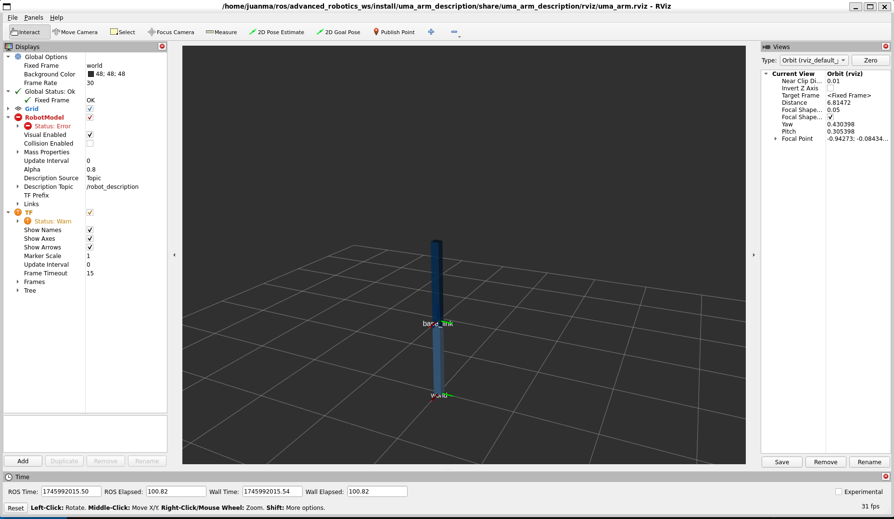
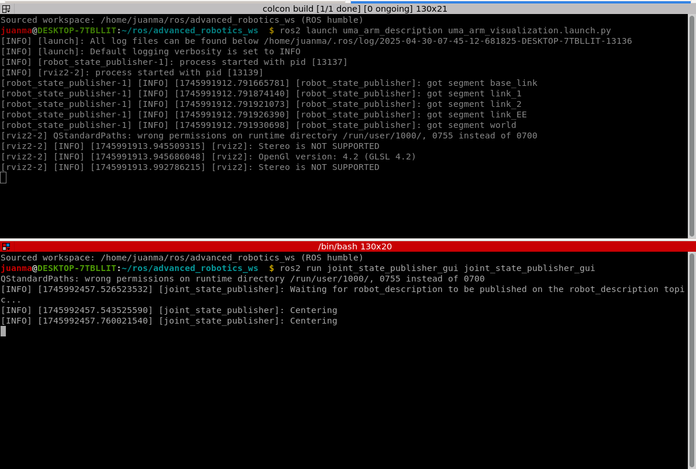
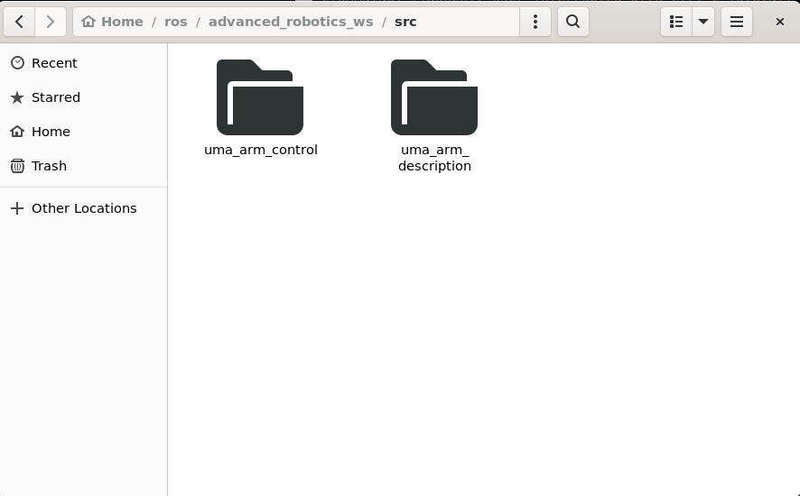
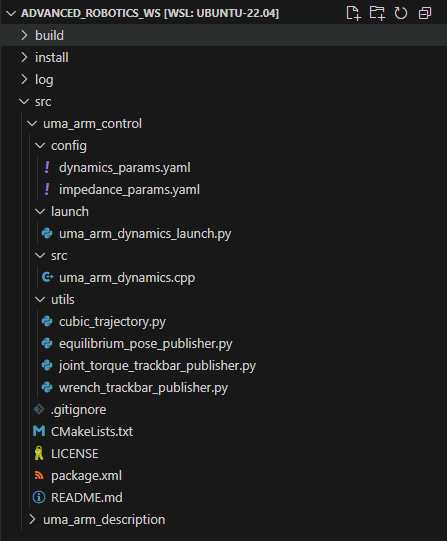
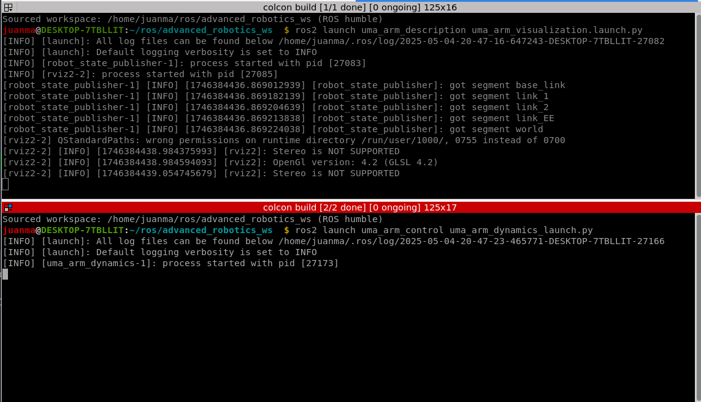
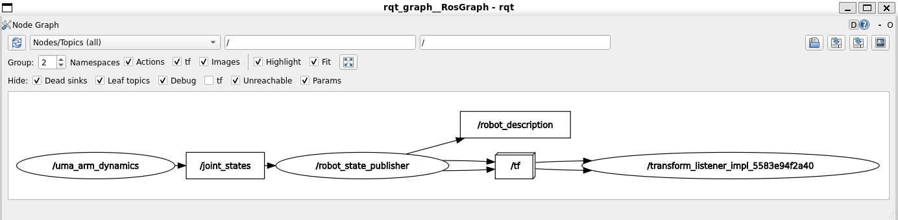

# Lab 2: Manipulator dynamics simulation

## 1. Setup ROS 2

For this lab session we will use ROS 2 Humble.

You'll need to install the [uma_environment_tools](https://github.com/jmgandarias/uma_environment_tools) as it will install ROS2 Humble, and some important packages and libraries that we'll use in the course.
In that repo, you'll find the required steps to install it.

If you already have a native version of Ubuntu 22.04 installed, you can skip steps 1 and 2.

A video of the installation, including the troubleshooting (if you don't find the errors, you don't need to run that part!) is shown below. Note that the video shows the installation with WSL. If you're using a native Ubuntu 22.04, you can skip the first instruction.


### 1.1. Testing the UMA environment

Once you have installed the UMA environment, you should see that everything is working correctly.

Try the following;

```bash
create_catkin_ws
```

Put the name `advanced_robotics_ws` to your workspace. 

If, after installing it, you go to your catkin workspace folder and when you run this alias

```bash
cb
```

you find an error like `'ROS colcon build is not installed'`, then you'll need to uninstall ros and install the environment again:

```bash
sudo apt remove ~nros-humble-* && sudo apt autoremove
sudo rm /etc/apt/sources.list.d/ros2.list
sudo apt update
sudo apt autoremove
# Consider upgrading for packages previously shadowed.
sudo apt upgrade
cd ~/uma_environment_tools/scripts
./install_uma_environment.sh
```

Then you'll ned to run

```bash
update_uma_environment
```

---

## 2. Install UMA manipulator package

You'll need to clone the `uma_arm_description` repository inside 

```bash
cdw
cd src
git clone https://github.com/jmgandarias/uma_arm_description.git
```

!!! warning 
    This is a work-in-progress repository. Don't pay attention to the README.md file of that repo.

!!! info 
    You don't have to modify anything in this package. You just need it visualize the manipulator.

Now, before compiling it, you'll need to install a series of dependencies:

```bash
sudo apt install ros-${ROS_DISTRO}-xacro
sudo apt install ros-${ROS_DISTRO}-gazebo-ros-pkgs
sudo  apt install ros-${ROS_DISTRO}-ros2-control ros-${ROS_DISTRO}-ros2-controllers ros-${ROS_DISTRO}-gazebo-ros2-control
sudo apt-get install -y ros-${ROS_DISTRO}-joint-state-publisher-gui ros-${ROS_DISTRO}-rviz2
```

If you find an error trying to install these dependencies, most probably you'll need to update the packages repositories and upgrade them to the last version

```bash
sudo apt update
sudo apt upgrade
```

Once the dependencies are correctly installed, you can compile the workspace

```bash
cdw
cb
```

### 2.1. Test the UMA manipulator package

Open one terminal and run:
```bash
ros2 launch uma_arm_description uma_arm_visualization.launch.py
```

You'll see RViz2 openning and showing the following:



You can open a new terminal and run the `joint_state_publisher_gui`to move joints of the robot

```bash
ros2 run joint_state_publisher_gui joint_state_publisher_gui 
```

!!! tip
    If you press `ctrl + shift + o` or `ctrl + shift + e` in the terminator terminal, it will split the terminals vertically or horizontally 

Now, you should have the following in your terminals



A GUI should have opened now allowing you to manually drive the joints of the manipulator


!!! success
    Great work! Now you are ready to do the Lab session 2!

You can also close all the terminals (press `ctrl + c`).

---

## 3. Simulate the robot dynamics

The manipulator model you've loaded is purely a kinematic visualization (i.e., there is no dynamics - no forces, and there is no simulation)

!!! info
    RViz 2 is 3D visualization tool, not a simulator. It means it allows you to see the robot models, sensor data, and other information shared in your ROS 2 environment in real-time and offers you a GUI to select the information to be visualize, but it is NOT a simulation

There are different ways to simulate the dynamics. The (probably) most straightforard one is to use a simulator as [Gazebo](https://gazebosim.org/home). However, as we are roboticists and want to see, touch, and learn the intrinsic effects of the dynamics of the robotic manipulator, we'll code the dynamics (the equations of motion) of the manipulator down into a node.

### 3.1. Clone the uma_arm_control package

To do this, we'll work with another package. You have to do the following

```bash
cdw
cd src
git clone https://github.com/jmgandarias/uma_arm_control.git
```

Once you have done this, your workspace folder should look like this



!!! tip
    You can open the Ubuntu file manager even if you're using WSL running nautilus in a terminal
    ```bash
    nautilus
    ```

Now you can compile your workspace
```bash
cdw
cb
```

!!! success
    Great work! You're now ready to implement the manipulator dynamics

But first, let's have a look at the `uma_arm_control` package distribution

### 3.2. Understanding the uma_arm_control package

The package is structured as shown in the following image



!!! tip
    You can directly open VSCode inside WSL by running `code` in a terminal

- **config**

    This folder contains configuration files that define various parameters. 

    - **dynamics_params.yaml**: This file contains parameters related to the dynamics of the robotic arm. *:pencil: You need to modify it in this lab.*
    - **impedance_params.yaml**: This file includes parameters for the impedance controller. *:calendar: You'll need to modify it in future sessions.*

- **launch**

    This folder contains launch scripts.

    - **uma_arm_dynamics_launch.py**: This Python script launches the dynamics simulation node for the robotic arm. *:lock: You don't have to modify it.*

- **src**

    This folder contains the source code for the dynamics control and simulation of the robotic arm:

    - **uma_arm_dynamics.cpp**: This C++ file contains the implementation of the dynamics equations (equations of motion) for the robotic arm. *:pencil: You need to modify it in this lab.*

- **utils:** This folder contains utility scripts that provide additional functionalities for the labs. *:lock: You don't have to modify it.*
- **.gitignore:** Specifies which files and directories should be ignored by Git version control. *:lock: You don't have to modify it.*
- **CMakeLists.txt:** Contains instructions for building the project using CMake, a build system generator. *:calendar: You'll need to modify it in future sessions.*
- **LICENSE:** The license file that specifies the terms under which the project can be used and distributed. *:lock: You don't have to modify it.*
- **package.xml:** Defines the package metadata for ROS, including dependencies and other information. *:lock: You don't have to modify it.*
- **README.md:** Provides an overview of the project, instructions for setup, usage, and other relevant information. *:pencil: You should modify it and keep it updated as you work on the lab sessions.*


### 3.3. Understanding the uma_arm_dynamics.cpp code

##### 3.3.1. Libraries :lock:

Includs the needed libraries. You don't have to modify it.

<details>
<summary>Show the code</summary>
```cpp title="libraries.cpp"
    --8<-- "snippets/lab2/libraries.cpp"
```
</details>

##### 3.3.2. Constructor :lock:

**ManipulatorDynamicsNode:** Inherits from rclcpp::Node, making it a ROS 2 node. The class `ManipulatorDynamicsNode` is a ROS 2 node responsible for computing the dynamics of the manipulator (robot arm). You don't have to modify it.

**ManipulatorDynamicsNode():** Class constructor that Initializes the node with the name `manipulator_dynamics_node`.

<details>
<summary>Show the code</summary>
```cpp title="constructor_initialization"
    --8<-- "snippets/lab2/constructor_initialization.cpp"
```
</details>

**Member variables initialization**

- `joint_positions_`, `joint_velocities_`, `joint_accelerations_`, `joint_torques_`, `external_wrenches_`: These are Eigen vectors initialized to zero. We'll use the library [Eigen](https://eigen.tuxfamily.org/index.php?title=Main_Page) to work with vectors and matrices in C++.
- `previous_time_`: Initialized to the current time using high_resolution_clock::now().

**Parameters declaration**

- `frequency`: The frequency at which the node operates (default 1000 Hz).
- `m1`, `m2`: Masses of the manipulator's links.
- `l1`, `l2`: Lengths of the manipulator's links.
- `b1`, `b2`: Damping coefficients.
- `g`: Gravitational acceleration.
- `q0`: Initial joint positions.

**Parameters Retrieval**

- `get_parameter`: Retrieves the values of the declared parameters and assigns them to member variables. The values of the parameters are defined in the `dynamics_params.yaml` file inside the config folder.

**Setting Initial Joint Positions**

- `joint_positions_`: Sets the initial joint positions using the parameter q0.

<details>
<summary>Show the code</summary>
```cpp title="constructor_publisher_subscriber"
    --8<-- "snippets/lab2/constructor_publisher_subscriber.cpp"
```
</details>

**Subscriptions**

- `joint_torques_subscription_`: Subscribes to the `joint_torques` topic, which is expected to publish messages of type `std_msgs::msg::Float64MultiArray`. The callback function `joint_torques_callback` is bound to handle incoming messages.
- `external_wrenches_subscription_`: Subscribes to the `external_wrenches` topic, which is expected to publish messages of type- `geometry_msgs::msg::Wrench`. The callback function `external_wrenches_callback` is bound to handle incoming messages.

**Publishers**

- `publisher_acceleration_`: Creates a publisher for the `joint_accelerations` topic, which will publish messages of type `std_msgs::msg::Float64MultiArray`.
- `publisher_joint_state_`: Creates a publisher for the `joint_states` topic, which will publish messages of type `sensor_msgs::msg::JointState`.

**Timer**

- `timer_`: Sets up a timer that triggers the `timer_callback` function (explained below) at a period determined by the frequency parameter. The period is expected to be given in milliseconds, therefore, it is calculated as 

$$
period \, \text{[ms]} = \frac{1 \, [\cancel{\text{s}}] \cdot 1000 \, [\text{ms}/\cancel{\text{s}}]}{frequency \, [\text{Hz}]} 
$$

##### 3.3.3. Timer callback :lock:

The `timer_callback` function is responsible for:

- Calculating the `elapsed_time_` between callbacks.
- Updating the new `joint_accelerations_`, `joint_velocities_`, and `joint_positions_` using the respective functions (you'll need to implement these functions later).
- Publishing the updated joint states to the ROS topics.

This function ensures that the manipulator's state is updated and communicated at regular intervals based on the timer's frequency.

<details>
<summary>Show the code</summary>
```cpp title="timer_callback"
    --8<-- "snippets/lab2/timer.cpp"
```
</details>

##### 3.3.4. Topic callbacks :lock:

These callback functions ensure that the node's state is updated with the latest data from the subscribed topics. Specifically:

- `joint_torques_callback`: Updates the `joint_torques_`  based on incoming messages.
- `external_wrenches_callback`: Updates the `external_wrenches_` based on incoming messages.

<details>
<summary>Show the code</summary>
```cpp title="topic_callbacks"
    --8<-- "snippets/lab2/callbacks.cpp"
```
</details>

##### 3.3.5. Calculate acceleration :pencil:
This method computes the `joint_accelerations_` of the manipulator by considering the equations of motion, including inertia, Coriolis and centrifugal forces, friction, gravitational forces, and external torques. You have to implement it as explained later.

At the moment, the method returns $\mathbf{\ddot{q}} = [0, 0]$.

 <details>
<summary>Show the code</summary>
```cpp title="calculate_acceleration"
    --8<-- "snippets/lab2/calculate_acceleration.cpp"
```
</details>

##### 3.3.6. Integrate position and velocity :pencil:
This method computes the joint velocities and positions by integrating over the elapsed time. You have to implement it as explained later.

At the moment, the methods return $\mathbf{\dot{q}} = \mathbf{q} = [0, 0]$.

 <details>
<summary>Show the code</summary>
```cpp title="Integrate_vel_pos"
    --8<-- "snippets/lab2/integrate_vel_pos.cpp"
```
</details>

##### 3.3.7. Publish the data :lock:
This method is responsible for publishing the computed `joint_accelerations_` and `joint_state` (`joint_positions_` and `joint_velocities_`) to their respective topics.

 <details>
<summary>Show the code</summary>
```cpp title="publish_data"
    --8<-- "snippets/lab2/publish_data.cpp"
```
</details>

#### 3.3.8. Member variables

Defines the member variables for the ManipulatorDynamicsNode class. Here's a detailed breakdown of these variables:
Member Variables

 <details>
<summary>Show the code</summary>
```cpp title="member_variables"
    --8<-- "snippets/lab2/member_variables.cpp"
```
</details>

**Publishers and Subscribers**

- `joint_torques_subscription_`: Subscription to the "joint_torques" topic.
- `external_wrenches_subscription_`: Subscription to the "external_wrenches" topic.
- `publisher_acceleration_`: Publisher for the "joint_accelerations" topic.
- `publisher_joint_state_`: Publisher for the "joint_states" topic.

**Joint Variables**

- `joint_positions_`: Eigen vector representing the positions of the joints ($\mathbf{q}$).
- `joint_velocities_`: Eigen vector representing the velocities of the joints ($\mathbf{\dot{q}}$).
- `joint_accelerations_`: Eigen vector representing the accelerations of the joints ($\mathbf{\ddot{q}}$).
- `joint_torques_`: Eigen vector representing the torques applied to the joints ($\boldsymbol{\tau}$).
- `external_wrenches_`: Eigen vector representing the external forces and torques applied to the EE ($\mathbf{F}_{ext}$).

**Dynamic Parameters Variables**

- `m1_`: Mass of the first link of the manipulator.
- `m2_`: Mass of the second link of the manipulator.
- `l1_`: Length of the first link of the manipulator.
- `l2_`: Length of the second link of the manipulator.
- `b1_`: Damping coefficient for the first joint.
- `b2_`: Damping coefficient for the second joint.
- `g_`: Gravitational acceleration.

**Time Variables**

- `timer_`: Timer that triggers the timer_callback function at a specified frequency.
- `previous_time_`: Stores the time of the previous callback execution.
- `elapsed_time_`: Stores the elapsed time between the current and previous callback executions ($\Delta t$).

#### 3.3.9. Main

Initializes the ROS 2 node, creates a shared pointer to an instance of the `ManipulatorDynamicsNode` class, keeps the node running, and shuts down the ROS 2 node when the node execution finishes.

 <details>
<summary>Show the code</summary>
```cpp title="main"
    --8<-- "snippets/lab2/main.cpp"
```
</details>

### 3.4. Implementing the dynamics model

The dynamics of an open kinematic chain robotic manipulator is given by 

$$
\mathbf{M}(\mathbf{q}) \ddot{\mathbf{q}} + \mathbf{C}(\mathbf{q}, \dot{\mathbf{q}}) \dot{\mathbf{q}} +  \mathbf{F}_b \dot{\mathbf{q}} + \mathbf{g}(\mathbf{q}) = \boldsymbol{\tau} + \boldsymbol{\tau}_{ext}
$$

where

- $\mathbf{q} \in \mathbb{R}^{n \times 1}$ is the vector of joint positions (`joint_positions_`).
- $\dot{\mathbf{q}} \in \mathbb{R}^{n \times 1}$ is the vector of joint velocities (`joint_velocities_`).
- $\ddot{\mathbf{q}} \in \mathbb{R}^{n \times 1}$ is the vector of joint accelerations (`joint_accelerations_`).
- $\mathbf{M}(\mathbf{q}) \in \mathbb{R}^{n \times n}$ is the inertia matrix.
- $\mathbf{C}(\mathbf{q}, \dot{\mathbf{q}}) \in \mathbb{R}^{n \times n}$ is the Coriolis and centrifugal forces matrix.
- $\mathbf{F}_b \in \mathbb{R}^{n \times n}$ is the viscous friction matrix.
- $\mathbf{g} \in \mathbb{R}^{n \times 1}$ is the viscous friction matrix.
- $\boldsymbol{\tau} \in \mathbb{R}^{n \times 1}$ is the vector of commanded joint torques (`joint_torques_`).
- $\boldsymbol{\tau}_{ext} \in \mathbb{R}^{n \times 1}$ is the vector of joint torques due to external forces.

In our case, as we have a 2 DoF manipulator, $n=2$.

Hence, the acceleration due to applied torques is given by

$$
\ddot{\mathbf{q}}  = \mathbf{M}^{-1}(\mathbf{q}) \left[  \boldsymbol{\tau} + \boldsymbol{\tau}_{ext} - \mathbf{C}(\mathbf{q}, \dot{\mathbf{q}}) \dot{\mathbf{q}} - \mathbf{F}_b \dot{\mathbf{q}} - \mathbf{g}(\mathbf{q}) \right]
$$

To calculate the joint accelerations, we first need to compute the matrices. They can be computed applying the Lagrange or the Newton-Euler formulations. In our case, the matrices are defined by:

$$
\mathbf{M}(\mathbf{q}) =\begin{bmatrix}
& \\
m_1 \cdot l_1^2 + m_2 \cdot (l_1^2 + 2 \cdot l_1 \cdot l_2 \cdot \cos(q_2) + l_2^2) & m_2 \cdot (l_1 \cdot l_2 \cdot \cos(q_2) + l_2^2) \\ 
m_2 \cdot (l_1 \cdot l_2 \cdot \cos(q_2) + l_2^2) & m_2 \cdot l_2^2\\
& \\
\end{bmatrix}
$$


$$
\mathbf{C}(\mathbf{q}, \dot{\mathbf{q}}) \dot{\mathbf{q}} = \begin{bmatrix}
& \\
-m_2 \cdot l_1 \cdot l_2 \cdot \sin(q_2) \cdot (2 \cdot \dot{q}_1 \cdot \dot{q}_2 +\dot{q}_2^2) \\
m_2 \cdot l_1 \cdot l_2 \cdot \dot{q}_1^2 \cdot \sin(q_2)\\
& \\
\end{bmatrix}
$$

$$
\mathbf{F}_b = \begin{bmatrix}
& \\
 b_1 & 0\\
0 & b_2\\
& \\
\end{bmatrix}
$$

$$
\mathbf{g}(\mathbf{q}) = \begin{bmatrix}
& \\
(m_1 + m_2) \cdot l_1 \cdot g_ \cdot \cos(q_1) + m_2 \cdot g_ \cdot l_2 \cdot \cos(q_1 + q_2) \\
m_2 \cdot g \cdot l_2 \cdot \cos(q_1 + q_2)\\
& \\
\end{bmatrix}
$$

We'll also need to compute the jacobian to include the external wrenches applied at the EE in our model

$$
\mathbf{J}(\mathbf{q}) = \begin{bmatrix}
& \\
-l_1 \cdot \sin(q_1) - l_2 \cdot \sin(q_1 + q_2) & -l_2 \cdot \sin(q_1 + q_2) \\
l_1 \cdot \cos(q_1) + l_2 \cdot \cos(q_1 + q_2) & l_2 \cdot \cos(q_1 + q_2)\\
& \\
\end{bmatrix}
$$

Then, we can calculate $\boldsymbol{\tau}_{ext}$ as 

$$
\boldsymbol{\tau}_{ext} = \mathbf{J}(\mathbf{q})^T \cdot \mathbf{F}_{ext}
$$

We can now code them as

```cpp
// Initialize M, C, Fb, g_vec, J, and tau_ext
Eigen::MatrixXd M(2, 2);
Eigen::VectorXd C(2);
Eigen::MatrixXd Fb(2, 2);
Eigen::VectorXd g_vec(2);
Eigen::MatrixXd J(2, 2);
Eigen::VectorXd tau_ext(2);

// Initialize q1, q2, q_dot1, and q_dot2
double q1 = joint_positions_(0);
double q2 = joint_positions_(1);
double q_dot1 = joint_velocities_(0);
double q_dot2 = joint_velocities_(1);

// Placeholder calculations for M, C, Fb, g, and tau_ext
// Calculate matrix M
M(0, 0) = m1_ * pow(l1_, 2) + m2_ * (pow(l1_, 2) + 2 * l1_ * l2_ * cos(q2) + pow(l2_, 2));
M(0, 1) = m2_ * (l1_ * l2_ * cos(q2) + pow(l2_, 2));
M(1, 0) = M(0, 1);
M(1, 1) = m2_ * pow(l2_, 2);

// Calculate vector C (C is 2x1 because it already includes q_dot)
C << -m2_ * l1_ * l2_ * sin(q2) * (2 * q_dot1 * q_dot2 + pow(q_dot2, 2)),
m2_ * l1_ * l2_ * pow(q_dot1, 2) * sin(q2);

// Calculate Fb matrix
Fb << b1_, 0.0,
0.0, b2_;

// Calculate g_vect
g_vec << (m1_ + m2_) * l1_ * g_ * cos(q1) + m2_ * g_ * l2_ * cos(q1 + q2),
    m2_ * g_ * l2_ * cos(q1 + q2);

// Calculate J
J << -l1_ * sin(q1) - l2_ * sin(q1 + q2), -l2_ * sin(q1 + q2),
    l1_ * cos(q1) + l2_ * cos(q1 + q2), l2_ * cos(q1 + q2);

// Calculate tau_ext
tau_ext << J.transpose() * external_wrenches_;

// Calculate joint acceleration using the dynamic model: M * q_ddot = torque - C * q_dot - Fb * joint_velocities_ - g + tau_ext
Eigen::VectorXd q_ddot(2);
q_ddot << M.inverse() * (joint_torques_ - C - Fb * joint_velocities_ - g_vec + tau_ext);

return q_ddot;

```

!!! tip
    I suggest you use *VSCode* and install the *C/C++ Themes* extension. Once installed, you can auto format the code (usually by pressing `ctrl + shift + i`)

As we are implementing a discrete system:

$$
\ddot{\mathbf{q}}_{k+1}  = \mathbf{M}^{-1}(\mathbf{q}_k) \left[  \boldsymbol{\tau}_k + \boldsymbol{\tau}_{{ext}_k} - \mathbf{C}(\mathbf{q}_k, \dot{\mathbf{q}}_k) \dot{\mathbf{q}}_k - \mathbf{F}_b \dot{\mathbf{q}}_k - \mathbf{g}(\mathbf{q}_k) \right]
$$

we can get the joint velocities and position by discrete integration over time as

$$
\dot{\mathbf{q}} = \int \ddot{\mathbf{q}} \, dt \implies \dot{\mathbf{q}}_{k+1} = \dot{\mathbf{q}}_k + \ddot{\mathbf{q}}_{k+1} \cdot \Delta t
$$

$$
\mathbf{q} = \int \dot{\mathbf{q}} \, dt \implies \mathbf{q}_{k+1} = \mathbf{q}_k + \dot{\mathbf{q}}_{k+1} \cdot \Delta t
$$

We can now code them as

```cpp
// Method to calculate joint velocity
Eigen::VectorXd calculate_velocity()
{
    // Placeholder for velocity calculation
    // Integrate velocity over the time step (elapsed_time_)
    Eigen::VectorXd q_dot = joint_velocities_ + joint_accelerations_ * elapsed_time_;

    return q_dot;
}

// Method to calculate joint position
Eigen::VectorXd calculate_position()
{
    // Placeholder for position calculation
    // Integrate position over the time step (elapsed_time_)
    Eigen::VectorXd q = joint_positions_ + joint_velocities_ * elapsed_time_;

    return q;
}
```

## 4. Launh the dynamics simulator node

Once you have coded the dynamics, open a terminal and compile it:

```bash
cdw
cb
```

!!! success
    Great! You've coded the manipulator dynamics and are now ready to launch the node to see how they work.

First, you'll need to launch the UMA manipulator ([step 2.1.](#21-test-the-uma-manipulator-package)).

Hence, you will need to open 2 terminals and launch the following:

#### Terminal 1

Launch the UMA manipulator model `uma_arm_visualization.launch.py`:

```bash
ros2 launch uma_arm_description uma_arm_visualization.launch.py
```

#### Terminal 2

Launch the dynamics model `uma_arm_dynamics_launch.py`:

```bash
ros2 launch uma_arm_control uma_arm_dynamics_launch.py
```

Hence, you should see the following




And the result of the simulation is


!!! tip
    - Note that the order when launching the scripts is important. You should first launch the `uma_arm_visualization`. By doing this, the robot model is loaded but it doesn't do anything until there's a message published in the topic `/joint_state`. 
    - Then you can launch the `uma_arm_dynamics`. This is what the dynamics model does: Computes the dynamic model, and publishes the joint state to update the visualization. Note also that the dynamics node doesn't need the uma_arm_visualization to work. If you only launch the dynamics, they're computed without showing them in the uma_arm_visualization. If you run the visualization after launching the 

You can see the interaction between topics and nodes by openning another terminal and running

```bash
rqt_graph
```

You have to select the option `Node/Topics (all)` and then update the graph.



## 5. Graphical representation

As robotics engineers, just seeing things work isn't enough for us. We want to understand how they work and be able to measure every parameter. One of the best ways to record the data of an experiment in ROS is to use [ros bags](https://docs.ros.org/en/humble/Tutorials/Beginner-CLI-Tools/Recording-And-Playing-Back-Data/Recording-And-Playing-Back-Data.html).

To record the data of the experiment, you can do the following:


1. Open a terminal, create the experiments folder, and start the rosbag recording:

    ```bash
    cd
    mkdir experiments
    ros2 bag record --all -o experiment1
    ros2 bag record --all
    ```

2. Open another terminal and launch the UMA manipulator model:

    ```bash
    ros2 launch uma_arm_description uma_arm_visualization.launch.py
    ```

3. Open another terminal and launch the dynamics model `uma_arm_dynamics_launch.py`:

    ```bash
    ros2 launch uma_arm_control uma_arm_dynamics_launch.py
    ```

When the experiment is finished (let's say, after around 15 seconds - when the manipulator is more or less steady) you can stop it by cancel the recording and killing the nodes. 

To represent time series of data in ROS 2, the [uma_environment](https://github.com/jmgandarias/uma_environment_tools) has installed the tool [plotjuggler](https://plotjuggler.io/). You can find more information on how to use plotjuggler in [this video](https://www.youtube.com/watch?v=9kFRecDU1bg).

You can run it by using the correspongind UMA environment alias

```bash
plotjuggler
```

Inside plotjuggler, and following the steps in the previous video, you can play the recorder rosbag. 
If you use the layout in [pos_vel_acc_layout.xml](../snippets/lab2/pos_vel_acc_layout.xml){:download}, you can plot the joint position, velocities, and accelerations.


!!! question
    What are the effects of modifying the dynamics parameters of the arm?

    You can modify some of the following parameters inside the `dynamics_params.yaml`: `m1`, `m2`, `b1`, `b2`, and `g`.
    Run different experiments and plot the data to see the effects of those parameters.

    *Note that you only need to modify those inside `uma_arm_dynamics`.* 


### Optional - Nice and vectorial graph representions

Plotjuggler is an excellent tool to play ROS topics data, and gives you some options to manipulate the data. However, sometimes you'll like to use a more powerful tool to manipulate the data such as matlab or python (with [matplotlib](https://matplotlib.org/stable/tutorials/pyplot.html)).

Plotjuggler allows you to save the data in *csv* format. This way, you can easily import the data with your preferred software to plot it. Below is an expample:


An alternative to this is to directly use the [ROS toolbox in Matlab](https://es.mathworks.com/help/ros/ref/rosbag.html) to get the 