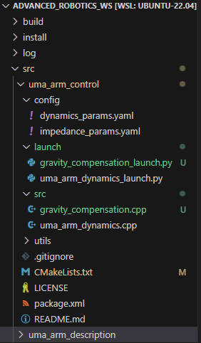
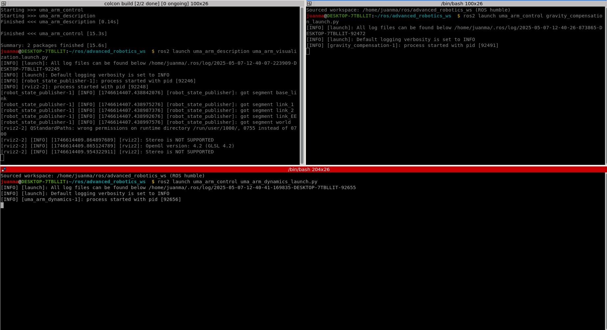
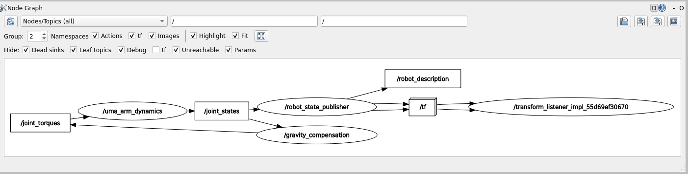
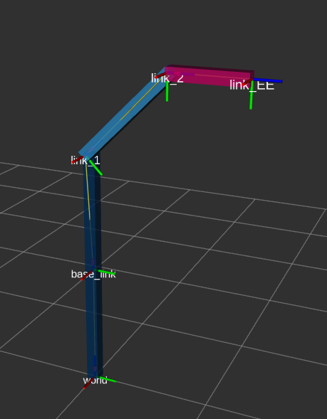
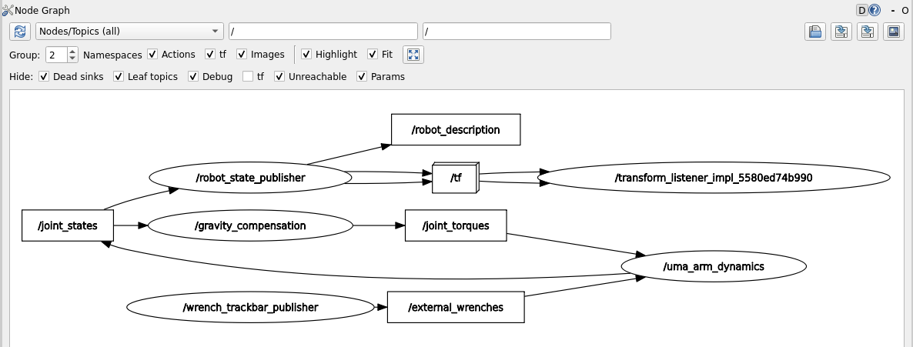
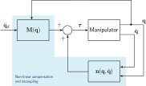
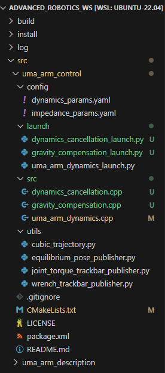
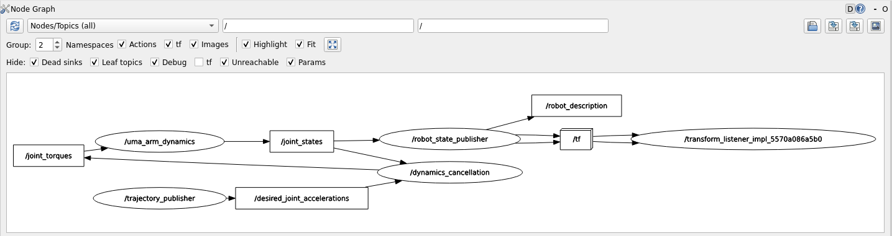
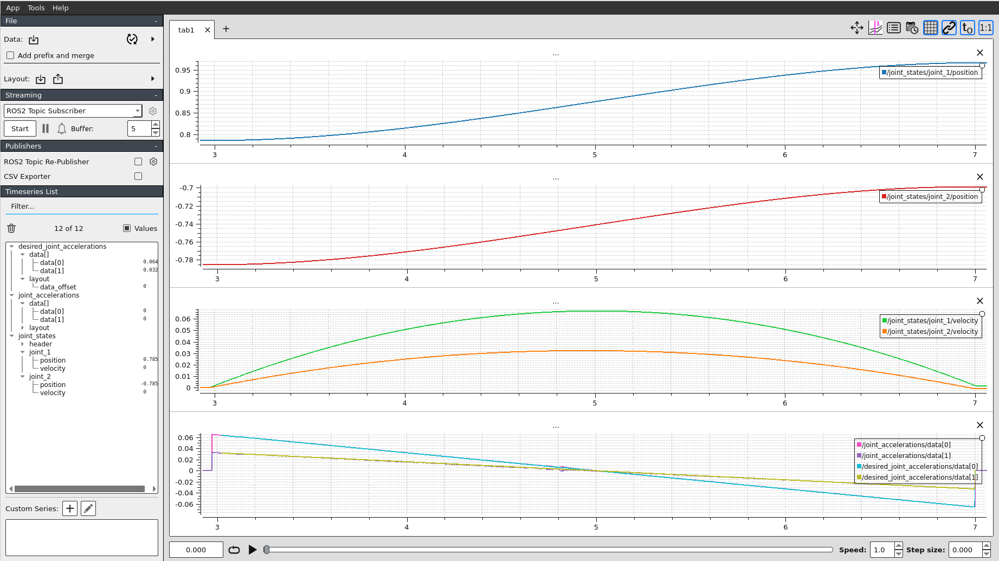

# Lab Session 3: Inverse Dynamics Control

In this lab session you will learn how to implement inverse dynamics controllers to compensate the non-linear dynamics of the manipulator to let you impose a specific  desired dynamic behavior of the manipulator. Note that you are expected to have finished the previous lab session as you'll need that implementation. 

## 3.1. Gravity compensation

### 3.1.1. Implementation
As you could have noticed in the previous lab, the gravitational effects on the manipulator makes it to "fall". Hence, out controller should include these effects when computing the joint torques that will be commanded to the actuators. The simplest inverse dynamics controller is the gravity compensation controller that set the torques of the actuators to be equal to those produced by gravity 

$$
\boldsymbol{\tau} = \mathbf{g}(\mathbf{q})
$$

To implement the gravity compensation controller you need to do the following:

1. Create the gravity compensation node: `gravity_compensation.cpp`

    <details>
    <summary>Show the code</summary>
    ```cpp title="gravity_compensation.cpp"
        --8<-- "snippets/lab3/gravity_compensation.cpp"
    ```
    </details>

2. You need to program the method `gravity_compensation()` to calculate de desired torques.
    ```cpp
    // Method to calculate the desired joint torques
    Eigen::VectorXd gravity_compensation()
    {
        // Placeholder for calculate the commanded torques
        // Calculate the control torque to compensate only for gravity effects: tau = g(q)

        // Calculate g_vect

        // // Calculate desired torque
        Eigen::VectorXd torque(2);
        torque << 0, 0;

        return torque;
    }
    ```
3. Create the `gravity_compensation_launch.py` file (you need to do this in order to get the dynamic pameters from the config file). You don't need to do any modification in this file, just include it inside the launch folder.
    <details>
    <summary>Show the code</summary>
    ```python title="gravity_compensation_launch.py"
        --8<-- "snippets/lab3/gravity_compensation_launch.py"
    ```
    </details>
4. Modify the `CMakeLists.txt` to include the new node
    <details>
    <summary>Show the code</summary>
    ```cmake title="CMakeLists.txt"
        --8<-- "snippets/lab3/CMakeLists_gravity.txt"
    ```
    </details>
4. Once you have done this, the uma_arm_control package should look like this:

    

5. Now, you can compile the workspace
    ```bash
    cdw
    cb
    ```

### 3.1.2. Launch the controller

To launch the controller you'll need to do the following:

1. Open one terminal and launch the uma_arm_visualization.
2. Open another terminal and launch the controller.
3. Open another terminal and launch the dynamics model



If you run the `rqt_graph` you should see how the gravity compensation node is getting the `joint_state` and feeding the manipulator with the computed torques



As a result, now the manipulator stays in the initial position defined by $\mathbf{q}_0 = [45^o, -45^o]$ (note that the initial position is defined by `q0` in the `dynamics_params.yaml`config file).



### 3.1.3. Simulating the force sensor

As we don't have a proper simulator where we could attach a simulated F/T sensor to the robot EE and apply forces against virtual objects, what we can do is to virtually apply forces to the EE of the robot. We can do this because, in the previous lab, we inmplemented considered the dynamics effects of external wrenches applied to the EE in the robot dynamics model.

$$
\boldsymbol{\tau}_{ext} = \mathbf{J}(\mathbf{q})^T \cdot \mathbf{F}_{ext}
$$

Hence, we can simulate an F/T sensor with a node that publishes virtual wrenches. To do this, you can use the `wrench_trackbar_publisher.py` utility included in the `uma_control` package.

<details>
    <summary>Show the code</summary>
    ```python title="wrench_trackbar_publisher.py"
        --8<-- "snippets/lab3/wrench_trackbar_publisher.py"
    ```
</details>

Note that you don't have to change anything in that script. You can run it by openning a terminal and running the following:

```bash
cdw
cd src/uma_arm_control/utils
python3 wrench_trackbar_publisher.py
```

Once you have done this, you'll see a GUI that allows you to publish virtual forces and torques. Note that, as our robot has only 2 DoFs and the dynamics model considers only the 2D XY plane, only forces applied at the X and Y axes will have an effect on our robot. This GUI has two operation modes: The continuous mode and the instantaneuos mode. You can see how they work in this video:


Launch the dynamics model and the gravity compensation controller and apply virtual forces. Your rqt_graph should then look like this:



!!! question
    What is the behavior of the robot when you apply virtual forces to the EE? Use videos and/or plots to support your answer.

## 3.2. Linearization by inverse dynamics control

### 3.2.1. Implementation

Now, we can compensate the whole non-linear dynamics of the manipulator by feedback linearization. This way, we'll theoretically be able to force the manipulator to achieve a desired dynamics behavior without being affected by their own dynamics (note that this is only true when the dynamics model perfectly matches the manipulator dynamics, which won't happen in the real world). 

To do this, you need to implement the following control schema



Then, we need to create a node that computes the non-linear dynamics cancellation based on the desired joint accelerations ($\ddot{\mathbf{q}}_d$) and the current joint state ($\mathbf{q}, \dot{\mathbf{q}}$). Then, the commanded joint torques computed with the inverse dynamics controller are given by

$$
\boldsymbol{\tau} = \mathbf{M}(\mathbf{q}) \cdot \ddot{\mathbf{q}}_d + \underbrace{\mathbf{C} (\mathbf{q}, \dot{\mathbf{q}}) \cdot \dot{\mathbf{q}} + \mathbf{F}_b \cdot \dot{\mathbf{q}} + \mathbf{g}}_{\mathbf{n}(\mathbf{q}, \dot{\mathbf{q}})}
$$

To implement the inverse dynamics controller you need to do the following:

1. Create the inverse dynamics cancellation node: `dynamics_cancellation.cpp`

 <details>
    <summary>Show the code</summary>
    ```cpp title="dynamics_cancellation.cpp"
        --8<-- "snippets/lab3/dynamics_cancellation.cpp"
    ```
    </details>

2. You need to program the method `cancel_dynamics()` to calculate de desired torques.
    ```cpp
    // Method to calculate the desired joint torques
    Eigen::VectorXd cancel_dynamics()
    {
         // Initialize M, C, Fb, g_vec, and tau_ext

        // Initialize q1, q2, q_dot1, and q_dot2

        // Calculate matrix M

        // Calculate vector C (C is 2x1 because it already includes q_dot)

        // Calculate Fb matrix

        // Calculate g_vect

        // Calculate control torque using the dynamic model: torque = M * q_ddot + C * q_dot + Fb * q_dot + g
        Eigen::VectorXd torque(2);
        torque << 0, 0;

        return torque;
    }
    ```
3. Create the `dynamics_cancellation_launch.py` file (you need to do this in order to get the dynamic pameters from the config file). You don't need to do any modification in this file, just include it inside the launch folder.
    <details>
    <summary>Show the code</summary>
    ```python title="dynamics_cancellation_launch.py"
        --8<-- "snippets/lab3/dynamics_cancellation_launch.py"
    ```
    </details>
4. Modify the `CMakeLists.txt` to include the new node
    <details>
    <summary>Show the code</summary>
    ```cmake title="CMakeLists.txt"
        --8<-- "snippets/lab3/CMakeLists_dynamics_cancellation.txt"
    ```
    </details>
4. Once you have done this, the uma_arm_control package should look like this:

    

5. Now, you can compile the workspace
    ```bash
    cdw
    cb
    ```

### 3.2.2. Launch the controller

To launch the inverse dynamics controller you'll need to do the following:

1. Open one terminal and launch the uma_arm_visualization.
2. Open another terminal and launch the controller.
3. Open another terminal and launch the dynamics model.

### 3.2.2. Expected results

If the inverse dynamics controller works well, when a trajectory is commanded to the controller, the manipulator should exactly follow that trajectory. 
We can test it by sending a cubic joint trajectory. To do this, the `uma_arm_control` package provides a cubic trajectory generator you can use.

You can generate the desired joint trajectory by openning a new terminal and running the following:

```bash
cdw
cd src/uma_arm_control/utils
python3 cubic_trajectory.py
```

Once you have done this, your rqt_graph should then look like this:



If you record the data of the experiment, you'll see the following:




## 3.3. Experiments

!!! question
    - What happens if the compensation dynamics model is not exactly the same as the manipulator dynamics? 

        1. Try to change the masses `m1`, `m2` and lengths `l1`, `l2` of the links in the `dynamics_params.yaml` (gravity_compensation) file. What are the effects of having incorrent dynamics parameters when launching the gravity compensation controller?
        2. Try the same for the dynamics cancellation. In this case, you can also change the parameters `b1` and `b2`. What are the effects when launching the dynamics cancellation controller?

    - What is the behavior of the robot under the inverse dynamics controller when you apply virtual forces to the EE? Use videos and/or plots to support your answer.
