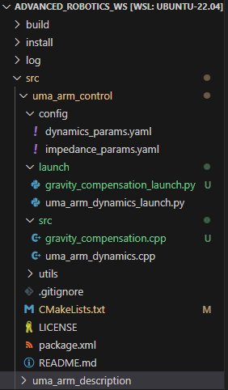
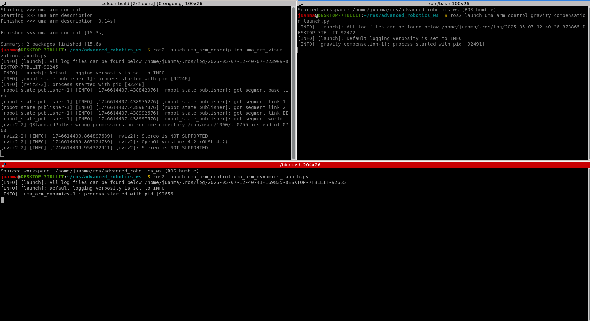
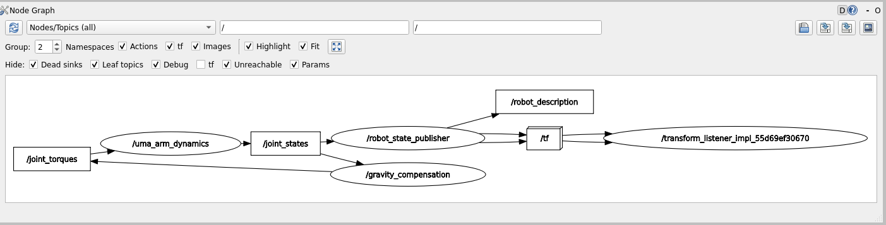
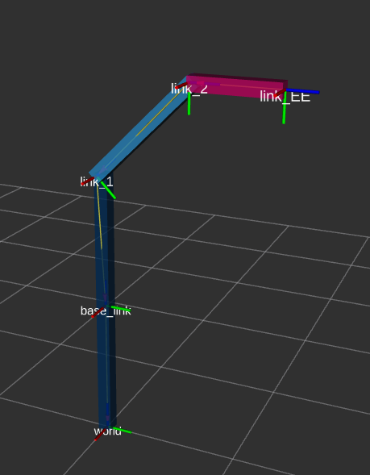
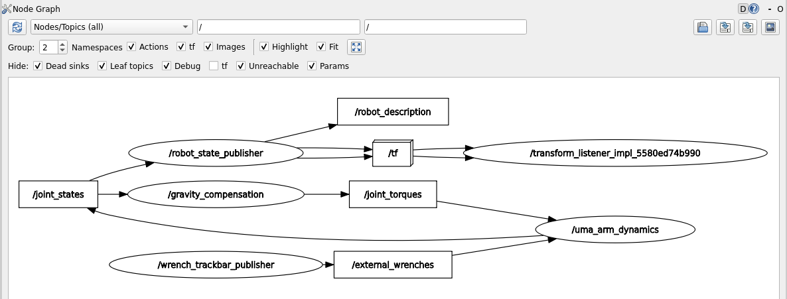
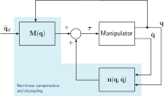
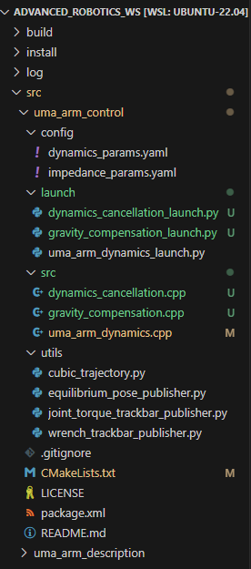
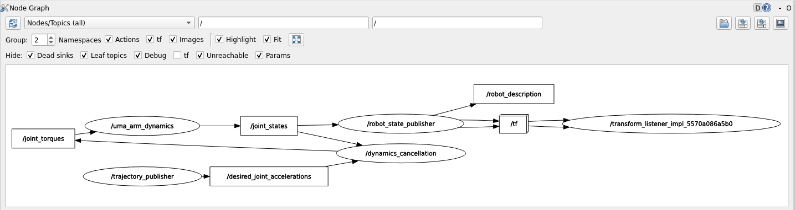
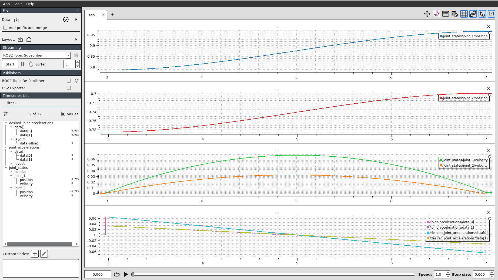

# Lab Session 3: Inverse Dynamics Control

In this lab session, you will learn how to implement inverse dynamics controllers to compensate for the non-linear dynamics of the manipulator, allowing you to impose a specific desired dynamic behavior. Note that you are expected to have finished the previous lab session, as you will need that implementation.

## 3.1. Gravity compensation

### 3.1.1. Implementation
As you may have noticed in the previous lab, gravitational effects on the manipulator make it "fall." Therefore, our controller should include these effects when computing the joint torques commanded to the actuators. The simplest inverse dynamics controller is the gravity compensation controller, which sets the actuator torques equal to those produced by gravity.

$$
\boldsymbol{\tau} = \mathbf{g}(\mathbf{q})
$$

To implement the gravity compensation controller you need to do the following:

1. Create the gravity compensation node: `gravity_compensation.cpp`

    <details>
    <summary>Show the code</summary>
    ```cpp title="gravity_compensation.cpp"
        --8<-- "snippets/lab3/gravity_compensation.cpp"
    ```
    </details>

2. You need to program the method `gravity_compensation()` to calculate the desired torques.
    ```cpp
    // Method to calculate the desired joint torques
    Eigen::VectorXd gravity_compensation()
    {
        // Placeholder for calculate the commanded torques
        // Calculate the control torque to compensate only for gravity effects: tau = g(q)

        // Calculate g_vect

        // // Calculate desired torque
        Eigen::VectorXd torque(2);
        torque << 0, 0;

        return torque;
    }
    ```
3. Create the `gravity_compensation_launch.py` file (you need to do this in order to get the dynamic parameters from the config file). You don't need to modify this file; just include it in the launch folder.
    <details>
    <summary>Show the code</summary>
    ```python title="gravity_compensation_launch.py"
        --8<-- "snippets/lab3/gravity_compensation_launch.py"
    ```
    </details>
4. Modify `CMakeLists.txt` to include the new node.
    <details>
    <summary>Show the code</summary>
    ```cmake title="CMakeLists.txt"
        --8<-- "snippets/lab3/CMakeLists_gravity.txt"
    ```
    </details>
5. Once you have done this, the `uma_arm_control` package should look like this:

    

6. Now, you can compile the workspace:
    ```bash
    cdw
    cb
    ```

### 3.1.2. Launch the controller

To launch the controller you'll need to do the following:

1. Open one terminal and launch the uma_arm_visualization.
2. Open another terminal and launch the controller.
3. Open another terminal and launch the dynamics model



If you run `rqt_graph`, you should see that the gravity compensation node receives `joint_state` and feeds the manipulator with the computed torques.



As a result, the manipulator now stays in the initial position defined by $\mathbf{q}_0 = [45^o, -45^o]$ (note that the initial position is defined by `q0` in the `dynamics_params.yaml` config file).



### 3.1.3. Simulating the force sensor

As we don't have a proper simulator where we could attach a simulated F/T sensor to the robot EE and apply forces against virtual objects, we can virtually apply forces to the robot EE. We can do this because, in the previous lab, we implemented and considered the dynamic effects of external wrenches applied to the EE in the robot dynamics model.

$$
\boldsymbol{\tau}_{ext} = \mathbf{J}(\mathbf{q})^T \cdot \mathbf{F}_{ext}
$$

Hence, we can simulate an F/T sensor with a node that publishes virtual wrenches. To do this, you can use the `wrench_trackbar_publisher.py` utility included in the `uma_control` package.

<details>
    <summary>Show the code</summary>
    ```python title="wrench_trackbar_publisher.py"
        --8<-- "snippets/lab3/wrench_trackbar_publisher.py"
    ```
</details>

Note that you don't have to change anything in that script. You can run it by opening a terminal and running the following:

```bash
cdw
cd src/uma_arm_control/utils
python3 wrench_trackbar_publisher.py
```

Once you have done this, you'll see a GUI that allows you to publish virtual forces and torques. Note that, as our robot has only 2 DoFs and the dynamics model considers only the 2D XY plane, only forces applied along the X and Y axes will have an effect on our robot. This GUI has two operation modes: continuous mode and instantaneous mode. You can see how they work in this video:


Launch the dynamics model and the gravity compensation controller and apply virtual forces. Your rqt_graph should then look like this:



!!! question
    What is the behavior of the robot when you apply virtual forces to the EE? Use videos and/or plots to support your answer.

## 3.2. Linearization by inverse dynamics control

### 3.2.1. Implementation

Now, we can compensate the whole non-linear dynamics of the manipulator through feedback linearization. This way, we'll theoretically be able to force the manipulator to achieve a desired dynamic behavior without being affected by its own dynamics (note that this is only true when the dynamics model perfectly matches the manipulator dynamics, which won't happen in the real world).

To do this, you need to implement the following control scheme:



Then, we need to create a node that computes non-linear dynamics cancellation based on the desired joint accelerations ($\ddot{\mathbf{q}}_d$) and the current joint state ($\mathbf{q}, \dot{\mathbf{q}}$). The commanded joint torques computed with the inverse dynamics controller are given by:

$$
\boldsymbol{\tau} = \mathbf{M}(\mathbf{q}) \cdot \ddot{\mathbf{q}}_d + \underbrace{\mathbf{C} (\mathbf{q}, \dot{\mathbf{q}}) \cdot \dot{\mathbf{q}} + \mathbf{F}_b \cdot \dot{\mathbf{q}} + \mathbf{g}}_{\mathbf{n}(\mathbf{q}, \dot{\mathbf{q}})}
$$

To implement the inverse dynamics controller you need to do the following:

1. Create the inverse dynamics cancellation node: `dynamics_cancellation.cpp`

 <details>
    <summary>Show the code</summary>
    ```cpp title="dynamics_cancellation.cpp"
        --8<-- "snippets/lab3/dynamics_cancellation.cpp"
    ```
    </details>

2. You need to program the method `cancel_dynamics()` to calculate the desired torques.
    ```cpp
    // Method to calculate the desired joint torques
    Eigen::VectorXd cancel_dynamics()
    {
         // Initialize M, C, Fb, g_vec, and tau_ext

        // Initialize q1, q2, q_dot1, and q_dot2

        // Calculate matrix M

        // Calculate vector C (C is 2x1 because it already includes q_dot)

        // Calculate Fb matrix

        // Calculate g_vect

        // Calculate control torque using the dynamic model: torque = M * q_ddot + C * q_dot + Fb * q_dot + g
        Eigen::VectorXd torque(2);
        torque << 0, 0;

        return torque;
    }
    ```
3. Create the `dynamics_cancellation_launch.py` file (you need to do this in order to get the dynamic parameters from the config file). You don't need to modify this file; just include it in the launch folder.
    <details>
    <summary>Show the code</summary>
    ```python title="dynamics_cancellation_launch.py"
        --8<-- "snippets/lab3/dynamics_cancellation_launch.py"
    ```
    </details>
4. Modify `CMakeLists.txt` to include the new node.
    <details>
    <summary>Show the code</summary>
    ```cmake title="CMakeLists.txt"
        --8<-- "snippets/lab3/CMakeLists_dynamics_cancellation.txt"
    ```
    </details>
5. Once you have done this, the `uma_arm_control` package should look like this:

    

6. Now, you can compile the workspace:
    ```bash
    cdw
    cb
    ```

### 3.2.2. Launch the controller

To launch the inverse dynamics controller you'll need to do the following:

1. Open one terminal and launch the uma_arm_visualization.
2. Open another terminal and launch the controller.
3. Open another terminal and launch the dynamics model.

### 3.2.3. Expected results

If the inverse dynamics controller works well, when a trajectory is commanded to the controller, the manipulator should exactly follow that trajectory. 
We can test it by sending a cubic joint trajectory. To do this, the `uma_arm_control` package provides a cubic trajectory generator you can use.

You can generate the desired joint trajectory by opening a new terminal and running the following:

```bash
cdw
cd src/uma_arm_control/utils
python3 cubic_trajectory.py
```

Once you have done this, your rqt_graph should then look like this:



If you record the data of the experiment, you'll see the following:




## 3.3. Experiments

!!! question
    - What happens if the dynamics compensation model is not exactly the same as the manipulator dynamics?

        1. Try changing the masses `m1`, `m2` and lengths `l1`, `l2` of the links in the `dynamics_params.yaml` (gravity compensation) file. What are the effects of having incorrect dynamic parameters when launching the gravity compensation controller?
        2. Try the same for the dynamics cancellation. In this case, you can also change the parameters `b1` and `b2`. What are the effects when launching the dynamics cancellation controller?

    - What is the behavior of the robot under the inverse dynamics controller when you apply virtual forces to the EE? Use videos and/or plots to support your answer.

## 3.4. Extra (optional)

Create a node that implements the PD controller presented in Fig. 4 (stabilizing linear control block) of the lecture slides. Specify a desired joint position $\mathbf{q}_d$ (inside the joint workspace) and set $\dot{\mathbf{q}}_d = \boldsymbol{0}$, $\ddot{\mathbf{q}}_d = \boldsymbol{0}$. 

This node must subscribe to the current joint state topic `/joint_states` to get the current joint positions ($\mathbf{q}$) and velocities ($\dot{\mathbf{q}}$); and it must then publish the desired joint accelerations ($\ddot{\mathbf{q}}_d$) in the topic `/desired_joint_accelerations` to which the dynamics cancellation node will subscribe.

Select and report the values chosen for $\mathbf{K}_P$ and $\mathbf{K}_D$. You can use MATLAB to simulate the expected dynamic behavior of the overall system.