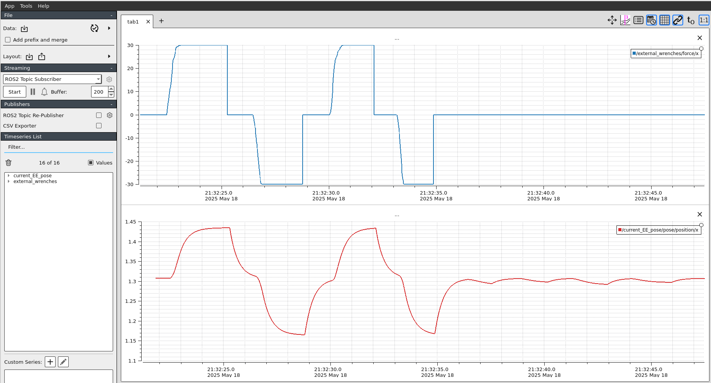
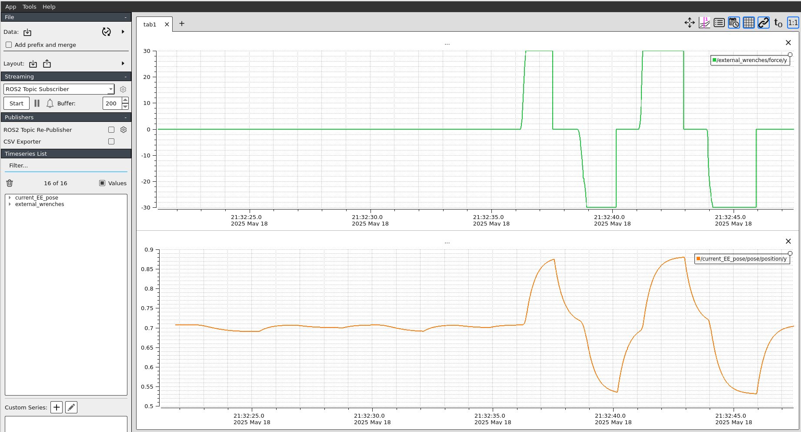
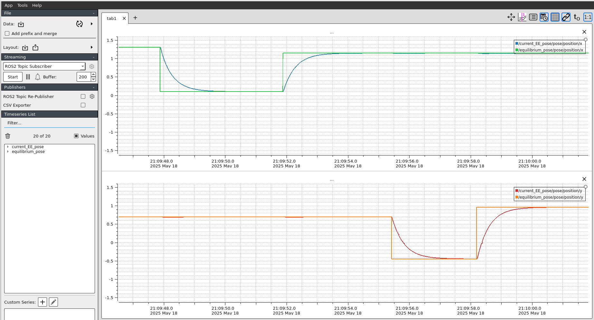

# Lab Session 4: Impedance Control

## 4.1. Cartesian impedance control
In this lab session we are going to implement a Cartesian Impedance Controller. 

The controller will be implemented according to the following scheme

## 4.2. Controller implementation

To implement the impedance controller following the previous control scheme, you need to create a new node called impedance_controller.cpp.

This script computes the dynamic model of a RR manipulator according to the impedance model:

F_ext - k x_error - B x'_error = M x''

where x_error = x_d - x, and x'_error = x'_d - x'

then: x'' = M^(-1)[F_ext - k x_error - B x'_error]

- To compute x_error and x'_error, we need the current x and x'.
They can be computed with the forward kinematics model and first-order differential kinematics:

Forward kinematics: x  =  f(q)
First-order differential kinematics: x' = J(q) q'

- We assume F_ext is given from the measures of an F/T sensor in the EE.

- The computed x'' represents the desired dynamic behavior of the manipulator at the EE level, but it must be transformed to the
joint space. It can be done with the second order differential kinematics (deriving the first-order kinematics):

First-order differential kinematics:   q'  = J(q)^(-1) x'
Second-order differential kinematics:  q'' = J(q)^(-1)[x'' - J'(q',q)q']

## 4.3. Experiment 1: 

!!! question
    - Does the forces applied in axis X generate motions in axis Y? And does the forces applied in axis Y generate motions in axis X? 
    - Can you explain why applying forces in one axis generate motions in the other axis? 
    - How do you think this phenomena can be reduced/mitigated?

!!! question
    - What are the effects of changing the impedance parameters (`M`, `B`, `K`) in the `impedance_params.yaml` file?
    - What are the effects of having a "high impedance" in axis X and "low impedance" in axis Y?

## 4.4. Experiment 2:

!!! question
    - Play with the simulation by publishing different desired equilibrium poses. Test the simulation to the extreme by taking the robot to difficult joint configurations. Don't worry about the robot, it's just a simulation and it won't break :) 

    - Did you find that the robot makes strange or unwanted motions, can you report them and explain why it happens?
