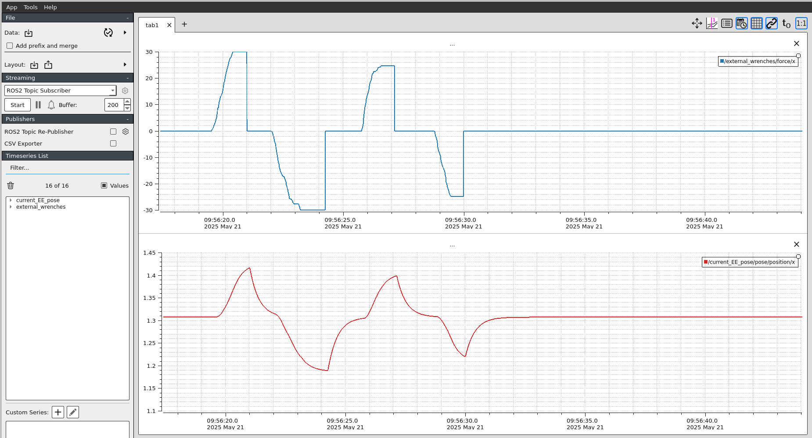
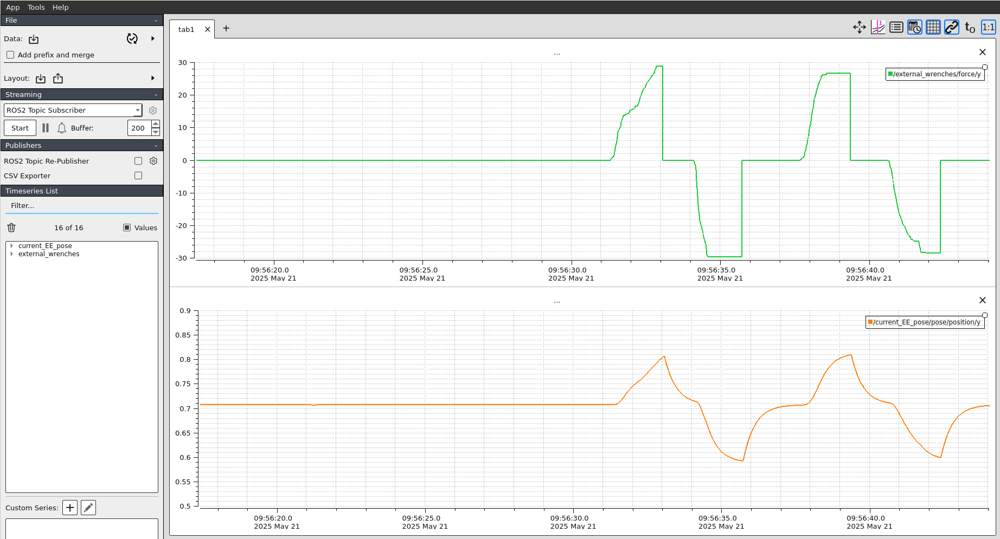

# Lab Session 4: Impedance Control

## 4.1. Cartesian impedance control
In this lab session we are going to implement a Cartesian Impedance Controller according to the following scheme:


## 4.2. Controller implementation

The controller has two levels:

- First, and close to the manipulator, we have the dynamics compensation at the joint level (the one you did in [Lab 3](../lab3/README.md)). 
- Then, at a higher level, we have the Cartesian impedance controller. As this controller operates in the operational space, we will need to transform between joint and Cartesian variables using the kinematics model, and the first- and second-order differential kinematics. To implement the impedance controller you need to create a new node called `impedance_controller.cpp`:

<details>
<summary>Show the code</summary>
```cpp title="impedance_controller.cpp"
    --8<-- "snippets/lab4/impedance_controller.cpp"
```
</details>

This node subscribes to:

- The desired equilibrium pose: equilibrium_pose ($\mathbf{x}_d$)
- The current joint states: joint_states ($\mathbf{q}, \dot{\mathbf{q}}$)
- The external wrenches: external_wrenches ($\mathbf{f}_{ext}$)

The node gest the impedance parameters ($\mathbf{M}$, $\mathbf{B}$, $\mathbf{K}$) from the `impedance_params.yaml` config file in the form of matrices called `mass_matrix_`, `damping_matrix_`, and `stiffness_matrix_`, respectively:

```cpp
auto M_vec = this->get_parameter("M").as_double_array();
auto B_vec = this->get_parameter("B").as_double_array();
auto K_vec = this->get_parameter("K").as_double_array();

check_matrix_size(M_vec, "M");
check_matrix_size(B_vec, "B");
check_matrix_size(K_vec, "K");

mass_matrix_ = Eigen::MatrixXd::Map(M_vec.data(), 2, 2);
damping_matrix_ = Eigen::MatrixXd::Map(B_vec.data(), 2, 2);
stiffness_matrix_ = Eigen::MatrixXd::Map(K_vec.data(), 2, 2);
```

In each loop (`timer_callback()`), the controller does the following:

<details>
<summary>Show the code</summary>
```cpp title="timer_callback"
    --8<-- "snippets/lab4/timer_callback.cpp"
```
</details>

1. :lock: First, the controller checks that the `joint_states`, the `external_wrenches`, and the `equilibrium_pose` are received correctly. Otherwise, the controller doesn't publish any reference.

    ```cpp
    if (!joint_states_received_ || !external_wrench_received_ || !equilibrium_pose_received_)
        {
            RCLCPP_WARN_THROTTLE(this->get_logger(), *this->get_clock(), 2000,
                                 "Waiting for all inputs: joint_states [%s], external_wrenches [%s], equilibrium_pose [%s]",
                                 joint_states_received_ ? "OK" : "MISSING",
                                 external_wrench_received_ ? "OK" : "MISSING",
                                 equilibrium_pose_received_ ? "OK" : "MISSING");
            return;
        }
    ```

2. :pencil: Then, the controller computes the forward kinematics needed to get $\mathbf{x}$ from $\mathbf{q}$ with the method `forward_kinematics()`:
    ```cpp
    cartesian_pose_ = forward_kinematics();  // Calculate cartesian pose
    ```
    You have to implement this method according to the forward kinematics:

    $$
    \mathbf{x} = \left[ \begin{matrix}
        \\
        l_1 cos(q_1) + l_2 cos(q_1 + q_2)\\
        l_1 sin(q_1) + l_2 sin(q_1 + q_2)\\
        \\
    \end{matrix}\right] 
    $$

    ```cpp
    // Method to calculate forward kinematics
    Eigen::VectorXd forward_kinematics()
    {
        // Placeholder for forward kinematics x = [l1 * cos(q1) + l2 * cos(q1 + q2), l2 * sin(q1) + l2 * sin(q1 + q2)]
        Eigen::VectorXd x(2);
        x << 0, 0;

        return x;
    }
    ```

3. :pencil: The controller needs to calculate the Jacobians based on the new data

    ```cpp
    update_jacobians(); // Update jacobian and jacobian derivative
    ```

    You have to implement the `update_jacobians()` method according to the following equations:

    $$ 
    \mathbf{J}(\mathbf{q}) = \left[\begin{matrix}
        \\
        -l_1 sin(q_1) - l_2 sin(q_1 + q_2) & -l_2 sin(q_1 + q_2)\\
        l_1 cos(q_1) + l_2 cos(q_1 + q_2) & l_2 cos(q_1 + q_2)\\
        \\
    \end{matrix}\right]
    $$

    $$ 
    \dot{\mathbf{J}}(\mathbf{q}, \dot{\mathbf{q}}) = \left[\begin{matrix}
        \\
        -l_1 cos(q_1) \dot{q}_1 - l_2 cos(q_1 + q_2) \dot{q}_1 & -l_2 cos(q_1 + q_2) \dot{q}_2\\
        -l_1 sin(q_1) \dot{q}_1 - l_2 sin(q_1 + q_2) \dot{q}_1 & -l_2 sin(q_1 + q_2) \dot{q}_2\\
        \\
    \end{matrix}\right] 
    $$


    ```cpp
    // Method to update jacobian and jacobian derivative
    void update_jacobians()
    {
        // Placeholder for jacobian and jacobian_derivative matrices

        // Calculate J(q)
        jacobian_ << 0,0,
            0,0;

        // Calculate J'(q,q')
        jacobian_derivative_ << 0,0,
            0,0;

        RCLCPP_INFO(this->get_logger(), "Jacobian:\n[%.3f, %.3f]\n[%.3f, %.3f]",
                    jacobian_(0, 0), jacobian_(0, 1),
                    jacobian_(1, 0), jacobian_(1, 1));

        double det = jacobian_.determinant();
        RCLCPP_INFO(this->get_logger(), "Jacobian determinant: %.6f", det);
    }
    ```

4. :pencil: Once $\mathbf{J}(\mathbf{q})$ has been computed, the controller can compute the `cartesian_velocities_` ($\mathbf{x}$) using the first-order differential kinematics (i.e., the Jacobian):

    ```cpp
    cartesian_velocities_ = differential_kinematics(); // Calculate Cartesian velocity with first-order differental kinematics
    ```

    You need to implement the `differential_kinematics()` method according to the following equations:

    $$
    \dot{\mathbf{x}} = \mathbf{J}(\mathbf{q}) \dot{\mathbf{q}}  
    $$


    ```cpp
    // Method to calculate Cartesian velocity with the first-order differential kinematics
    Eigen::MatrixXd differential_kinematics()
    {
        // Placeholder for first-order differential kinematics
        Eigen::VectorXd x_dot(2);
        x_dot << 0,0;

        return x_dot;
    }
    ```

5. :pencil: Once we have all the required data, we can compute de `desired_cartesian_accelerations_` ($\ddot{\mathbf{x}}_d$) according to the desired impedance behavior with the method `impedance_controller()`:

    ```cpp
    desired_cartesian_accelerations_ = impedance_controller(); // Calculate desired cartesian accelerations with impedance controller
    ```

    You can compute the desired cartesian accelerations according to the second-order impedance model:

    $$
    \mathbf{M} \ddot{\mathbf{\~{x}}} + \mathbf{B} \dot{\mathbf{\~{x}}} + \mathbf{B} \mathbf{\~{x}} = \mathbf{f}_{ext}
    $$

    Hence, if we assume that the only contribution to the motion of the robot is that given by the mechanical impedance model:

    $$
     \ddot{\mathbf{x}}_d = \mathbf{M}^{-1}( -\mathbf{B} \dot{\mathbf{\~{x}}} - \mathbf{B} \mathbf{\~{x}} + \mathbf{f}_{ext})
    $$

    where

    $$
    \begin{split}
    \mathbf{\~{x}} &= \mathbf{x} - \mathbf{x}_d\\
    \dot{\mathbf{\~{x}}} &= \dot{\mathbf{x}} - \dot{\mathbf{x}}_d
    \end{split}
    $$

    ```cpp
    // Method to compute the impedance controller
    Eigen::VectorXd impedance_controller()
    {
        // Placeholder for impedance controller calculation
        Eigen::VectorXd x_dot_d = Eigen::VectorXd::Zero(2); // We assume desired cartesian velocity = 0

        // Calculate Cartesian errors
        Eigen::VectorXd x_error << 0,0;
        Eigen::VectorXd x_dot_error << 0,0;

        // Replace with actual impedance controller equation: x'' = M^(-1)[F_ext - k x_error - B x'_error]
        Eigen::VectorXd x_ddot(2);
        x_ddot << 0,0;

        return x_ddot;
    }
    ```

6. :pencil: Now, we can calculate the `desired_joint_accelerations` with the second-order differential kinematics
        
    ```cpp
    desired_joint_accelerations_ = calculate_desired_joint_accelerations(); // Calculate the desired_joint_accelerations
    ```

    The second-order differential kinematics can be calculated as:

    $$
    \begin{split}
    \ddot{\mathbf{x}} &= \mathbf{J}(\mathbf{q}) \ddot{\mathbf{q}} + \dot{\mathbf{J}}(\mathbf{q}, \dot{\mathbf{q}}) \dot{\mathbf{q}}\\
    \ddot{\mathbf{q}} &= \mathbf{J}(\mathbf{q})^{-1}[\ddot{\mathbf{x}} - \dot{\mathbf{J}}(\mathbf{q}, \dot{\mathbf{q}}) \dot{\mathbf{q}}]
    \end{split}
    $$

    ```cpp
    // Method to calculate joint acceleration with the inverse of second-order differential kinematics
    Eigen::VectorXd calculate_desired_joint_accelerations()
    {
        // Placeholder for the second-order differential kinematics
        // q'' = J(q)^(-1)[x'' - J'(q,q')q']

        RCLCPP_INFO(this->get_logger(), "x_ddot: [%.3f, %.3f]",
                    desired_cartesian_accelerations_(0), desired_cartesian_accelerations_(1));

        q_ddot << 0,0;

        return q_ddot;
    }
    ```

7. :lock: Finally, the controller checks that the accelerations are calculated correctly before publishing the data

    ```cpp
    if ((desired_joint_accelerations_.array().isNaN()).any())
    {
        RCLCPP_ERROR(this->get_logger(), "Computed NaN in desired_joint_accelerations. Skipping publish.");
        return;
    }

    // Publish data
    publish_data();
    ```

As we did in Lab 3, you also need to create the `impedance_controller_launch.py`:

<details>
<summary>Show the code</summary>
```python title="impedance_controller_launch.py"
    --8<-- "snippets/lab4/impedance_controller_launch.py"
```
</details>

Finally, you also need to modify your `CMakeLists.txt`:

<details>
<summary>Show the code</summary>
```txt title="CMakeLists.txt"
    --8<-- "snippets/lab4/CMakeLists.txt"
```
</details>


Hence, your workspace will look like this:


## 4.3. Experiment 1: Apply virtual forces to the robot

Note that to run the experiment you'll need to launch the following in different terminals (the order is important!):

- UMA arm visualization: 
    ```bash
    ros2 launch uma_arm_description uma_arm_visualization.launch.py
    ```
- Impedance controller: 
    ```bash
    ros2 launch uma_arm_control impedance_controller_launch.py
    ```
- Dynamics cancellation: 
    ```bash
    ros2 launch uma_arm_control dynamics_cancellation_external_forces_launch.py
    ```
- External wrenches publisher: 
    ```bash
    cdw
    cd src/uma_arm_control/utils
    python3 wrench_trackbar_publisher.py 
    ```
- UMA arm dynamics: 
    ```bash
    ros2 launch uma_arm_control uma_arm_dynamics_launch.py
    ```


**Note that the video and the plots correspond to different experiments.*

!!! question
    - What are the effects of changing the impedance parameters (`M`, `B`, `K`) in the `impedance_params.yaml` file?
    - What are the effects of having a "high impedance" in axis X and "low impedance" in axis Y?

!!! question
    - Does the forces applied in the X axis generate motions in the Y axis? And does the forces applied in the Y axis generate motions in the X axis? 
    - Can you explain why applying forces in one axis generate motions in the other axis? 
    - How do you think this phenomena can be mitigated?
    - **[OPTIONAL]** Eliminate this undesired behavior to get results similar to the images below:

    

    


## 4.4. Experiment 2: Change the equilibrium pose

To carry out this experiemnt, you'll need to use the `equilibrium_pose_publisher.py` (please, be sure that you're using the code below. You might have an outdated version of this script in your workspace)

<details>
<summary>Show the code</summary>
```python title="equilibrium_pose_publisher.py"
    --8<-- "snippets/lab4/equilibrium_pose_publisher.py"
```
</details>

Note that to run the experiment you'll need to launch the following in different terminals (the order is important!):

- UMA arm visualization: 
    ```bash
    ros2 launch uma_arm_description uma_arm_visualization.launch.py
    ```
- Impedance controller: 
    ```bash
    ros2 launch uma_arm_control impedance_controller_launch.py
    ```
- Dynamics cancellation: 
    ```bash
    ros2 launch uma_arm_control dynamics_cancellation_external_forces_launch.py
    ```
- External wrenches publisher: 
    ```bash
    cdw
    cd src/uma_arm_control/utils
    python3 wrench_trackbar_publisher.py 
    ```
- Equilibrium pose publisher: 
    ```bash
    cdw
    cd src/uma_arm_control/utils
    python3 equilibrium_pose_publisher.py 
    ```
- UMA arm dynamics: 
    ```bash
    ros2 launch uma_arm_control uma_arm_dynamics_launch.py
    ```


**Note that the video and the plots correspond to different experiments.*

!!! question
    - Play with the simulation by publishing different desired equilibrium poses. Test the simulation to the extreme by taking the robot to difficult joint configurations. Don't worry about the robot, it's just a simulation and it won't break :) 

    - Did you find that the robot makes strange or unwanted motions, can you report them and explain why it happens?
