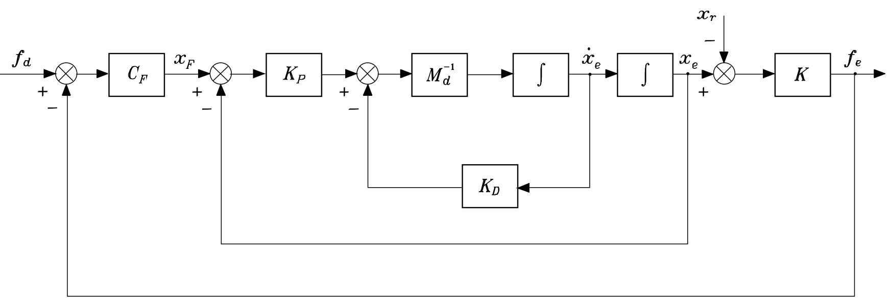

# Lab Session 5: Force Control

## 4.1. Introduction
In this lab we will simulate the dynamic behavior of the RR manipulator under a force control shceme with an internal position loop. As in the previous situation, the robot's dynamic behavior is linearized through the control law we used in the previous Labs

$$
\boldsymbol{\tau} = \mathbf{M}(\mathbf{q}) \cdot \ddot{\mathbf{q}}_d + \underbrace{\mathbf{C} (\mathbf{q}, \dot{\mathbf{q}}) \cdot \dot{\mathbf{q}} + \mathbf{F}_b \cdot \dot{\mathbf{q}} + \mathbf{g}}_{\mathbf{n}(\mathbf{q}, \dot{\mathbf{q}})} + \mathbf{J}^T(\mathbf{q})\mathbf{f}_{e}
$$

*Note that the effect of external forces is also included in the compensation.*

Hence, the manipulator follows a purely kinematic behavior expressed by the law:

$$
\ddot{\mathbf{q}} = \mathbf{J}(\mathbf{q})^{-1}[\ddot{\mathbf{x}} - \dot{\mathbf{J}}(\mathbf{q}, \dot{\mathbf{q}}) \dot{\mathbf{q}}]
$$

In this case, the goal is to implement the force control law indicated illustrated in the following schema according to the expression

$$
\mathbf{M}_d\ddot{\mathbf{x}}_e + \mathbf{K}_D \dot{\mathbf{x}}_e + \mathbf{K}_P (\mathbf{I}_3 + \mathbf{C}_F  \mathbf{K})\mathbf{x}_e = \mathbf{K}_P \mathbf{C}_F ( \mathbf{K} \mathbf{x}_r + \mathbf{f}_d)
$$

Here, the input signal to the system is now the reference force instead of a desired position. In the mentioned expression, $\mathbf{M}_d$, $\mathbf{K}_P$, and $\mathbf{K}_D$ retain the same meaning as the matrices $\mathbf{M}$, $\mathbf{B}$, and $\mathbf{K}$, respectively, and take the following values:

The variable $\mathbf{x}_F$ constitutes the system input and is defined as follows:

$$
\mathbf{x}_F = \mathbf{C}_F(\mathbf{f}_d - \mathbf{f}_e)
$$

where $ \mathbf{C}_F$ is a proportional constant, $\mathbf{f}_d$ is the reference force, and $\mathbf{f}_e$ is the force applied by the robot on the elastic surface. In this way, if an elastic surface model is considered, it holds that:

$$
\mathbf{f}_e = \mathbf{K}(\mathbf{x}_e - \mathbf{x}_r)
$$

Under these considerations, the following is requested:

<!-- ## 4.2. Calculate the undamped natural frequency and damping coefficient

From the equivalent equation of the robot in contact with the surface, calculate the undamped natural frequency ($\boldsymbol{\omega}_n$) and the damping ratio ($\boldsymbol{\zeta}$)-->

## 4.2. Simulate P control
Simulate in *SIMULINK* the dynamic behavior of the manipulator in contact with the environment using the equivalent model, assuming the contact position is 

$$
\mathbf{x}_r = [1.2,0.7] m
$$

and the desired force is 

$$
\mathbf{f}_d = [10, 0] N
$$

when

$$
\mathbf{x}_{e_{initial}} = [1.3,0.7] m \, , \quad
\mathbf{K} = \left[ \begin{matrix}
    & \\
1000 & 0\\
0 & 0\\
    & \\
\end{matrix} \right] N/m \, , \quad  
\mathbf{C}_F = \left[ \begin{matrix}
    & \\
0.05 & 0\\
0 & 0\\
    & \\
\end{matrix} \right]
$$ 

and

$$
\mathbf{M}_d = \left[ \begin{matrix}
    & \\
1000 & 0\\
0 & 1000\\
    & \\
\end{matrix} \right] N/m \, , \quad  
\mathbf{K}_D = \left[ \begin{matrix}
    & \\
5000 & 0\\
0 & 5000\\
    & \\
\end{matrix} \right] N/m \, , \quad
\mathbf{K}_P = \left[ \begin{matrix}
    & \\
5000 & 0\\
0 & 5000\\
    & \\
\end{matrix} \right] N/m 
$$ 

!!! question
    - Is the proposed controller correct? Why?
    - What is happening in the Y axis? Why?

## 4.3. Simulate PI control
   

With the proposed control scheme, due to disturbances introduced by $\mathbf{x}_r $, the reference force may not be reached in steady state. To address this, it is proposed to convert the constant CF into a proportional-integral action:

$$
\mathbf{C}_F = \mathbf{K}_F + \mathbf{K}_I \int^t (\cdot)  d \varsigma
$$

Implement this model in SIMULINK and simulate the dynamic behavior when 

$$
\mathbf{K}_F = \left[ \begin{matrix}
    & \\
0.03 & 0\\
0 & 0\\
    & \\
\end{matrix} \right] \, , \quad 
\mathbf{K}_I = \left[ \begin{matrix}
    & \\
0.03 & 0\\
0 & 0\\
    & \\
\end{matrix} \right]
$$

!!! question
    - Does this produce any improvement in the controller? Why?
    - Can you improve it more? How?
